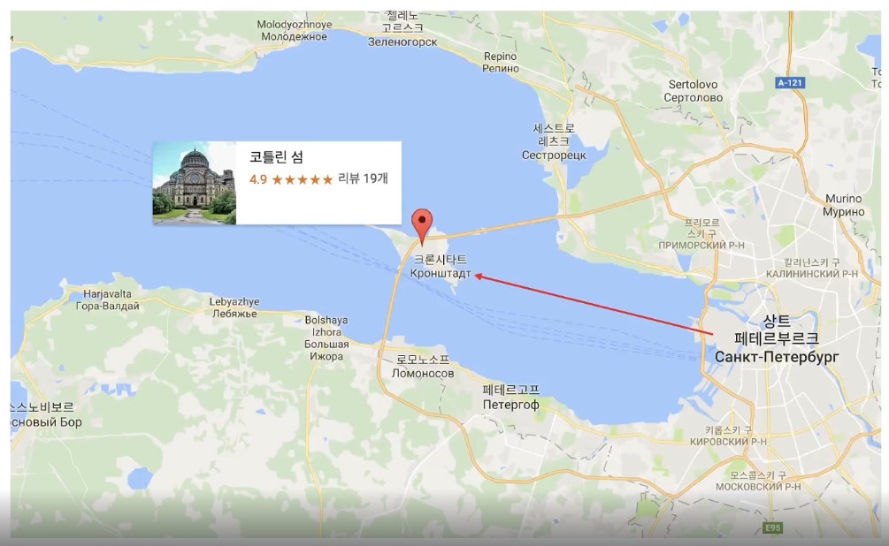
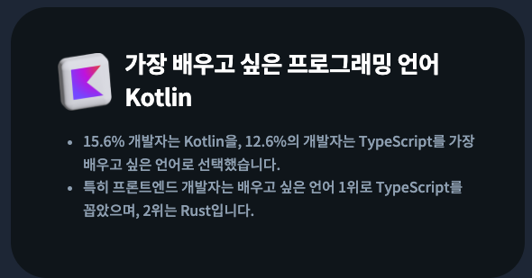
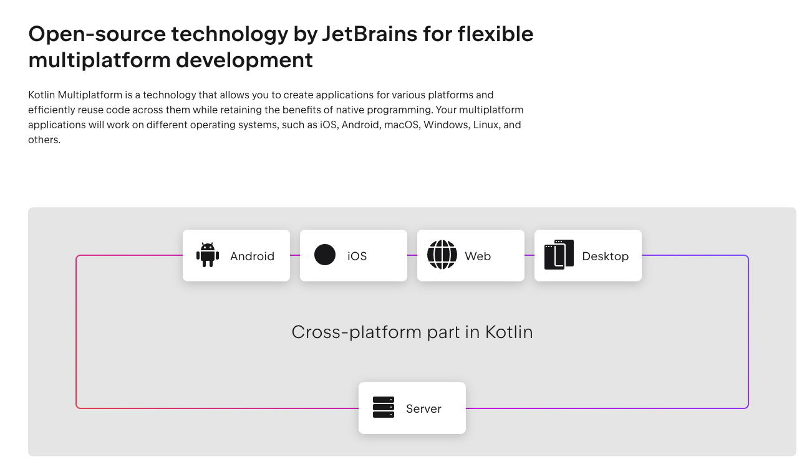
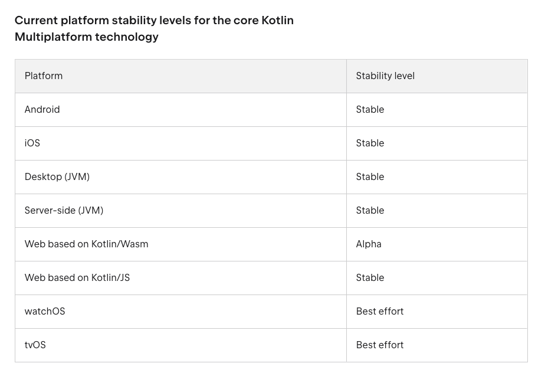

# Atom01 ~ 02

> 코틀린에 대한 상식 몇가지를 알아봅시당! 😇

- 코틀린은 `JetBrains` 라는 IntelliJ 통합개발환경을 만든 `체코` 회사에서 만들었다.
- 코틀린이라는 이름은 코틀린 섬(러시아섬)에서 따왔는데, 이는 JetBrains의 R&D 회사가 러시아 상트페테르부르크라는 곳에 있기 때문이다.

  

- 2022년 러우 전쟁 이후 상트페테르부르크 R&D 센터도 무기한 패쇄상태로 러시아내 이주를 동의한 직원들에 한해서 다른 나라로 재배치되었다고 한다.

- 자바와 비교하면, 자바 역시 인도네시아 자바섬에서 이름을 따왔기 때문에, 이와 유사한 방식으로 이름을 지은점을 감안해보면 타겟으로 하는 언어가 분명하다는 것을 유추할 수 있다.

- 2023년 프로그래머스 설문 조사에서 코틀린인 가장 배우고 싶은 언어 1위 차지. 자바 왕국인 대한민국임을 고려해보면 이해가되는 부분.

  

- 코틀린은 자바와 100% 호환가능하면서도 현재적이고 간결하며 안전한 언어를 사용하기 위한 목적으로 탄생된 언어이다. 여담으로 JetBrains에서 만드는 IntelliJ가 Java로 작성되어있는데, 유지보수하다 화가 났다는 설도 있다.
- 코틀린은 자바와 100% 호환가능하기때문에 JVM 위에서 동작한다. JVM 위에서 작동하는 언어는 자바와 코틀린외에도 Scala, Groovy 등이 있다.
- 코틀린은 멀티 플랫폼 언어로 AOS 앱개발, IOS 앱개발, 서버개발, 웹개발, 임베디드, IoT, 데스크톱까지 다양한 플랫폼과 데이터 사이언스까지 사용되는 것을 목표로 하고 있다.

  > [참고](https://www.jetbrains.com/help/kotlin-multiplatform-dev/supported-platforms.html)

  

  

- 구글의 AOS 개발 공식 문서에서 공식 언어를 2019년부터 코틀린으로 지정(`Kotlin First`). 튜터리얼 예제의 기본 코드를 모두 코틀린으로 변경했다고 한다.
- 코틀린은 정적타입 언어이다. 컴파일 시점에 타입을 알 수 있다. (타입 검증이 컴파일 시점)

  ```kotlin
  val name:String = "jjanmo"
  ```

- 객체지향 프로그래밍과 함수형 프로그래밍을 모두 지원
- 오픈소스
- 기타 소소한 Syntax - Java와는 다르게 세미콜론을 안붙여도 된다. - 주석 처리 방법

  ```kotlin
  // 한줄 주석

  /**
    * 여러줄 주석
    */
  ```

- public을 붙이지 않으면 모두 public으로 간주된다.
- 로그찍는 방법

  ```kotlin
    println("jjanmo")
    print("jjanmo")

  ```
