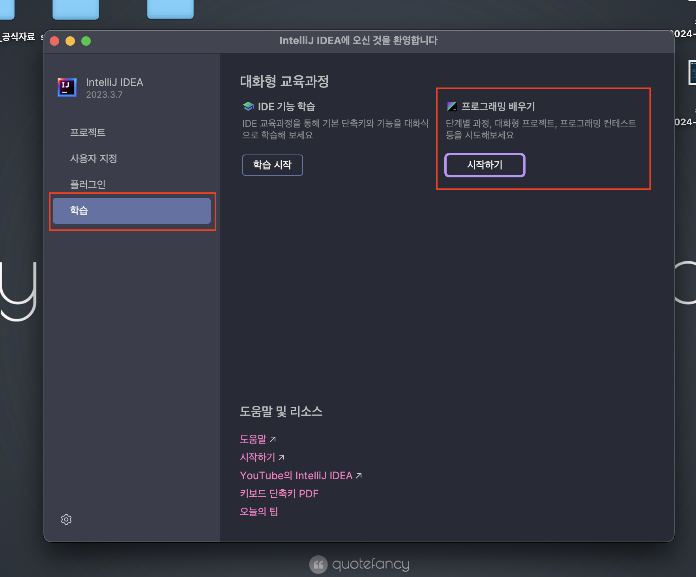
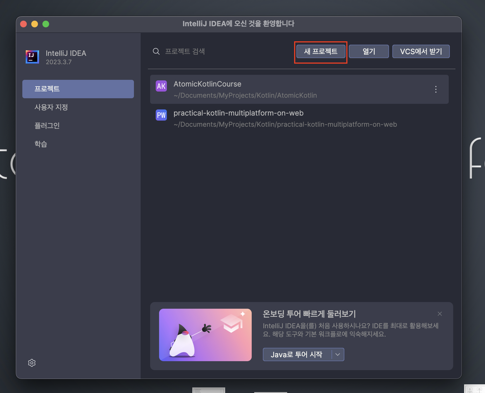
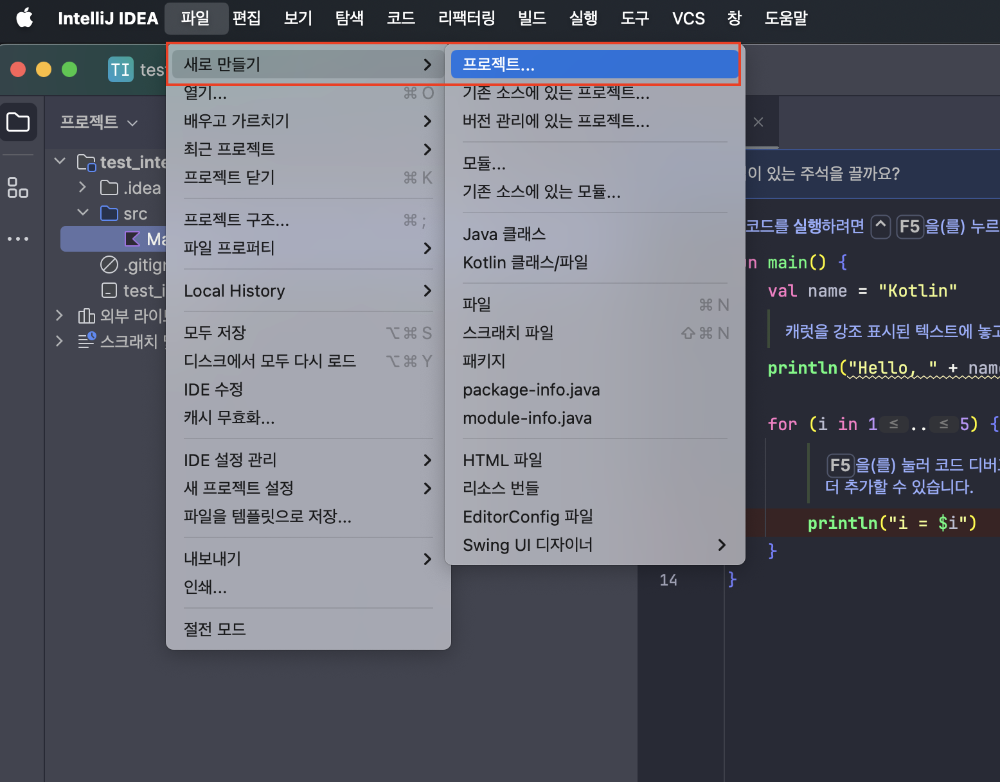
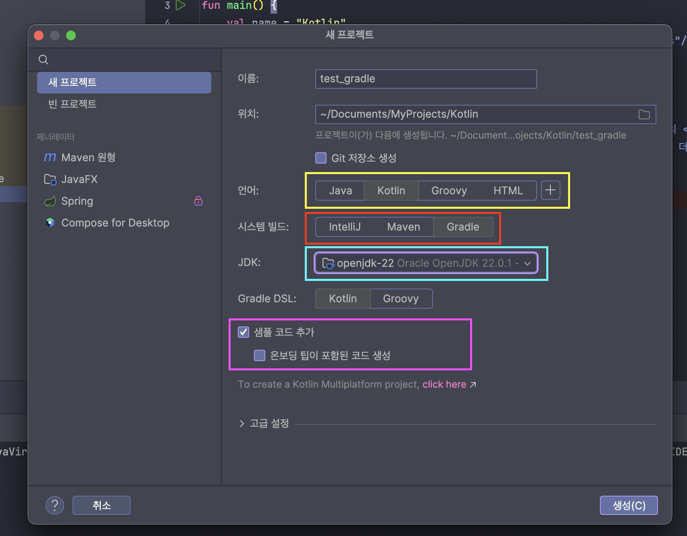

# Atom3

> 아토믹 코틀린 책에서 제공해주는 코틀린 실습방법에 대해서 알아봅니다.

1.  [코틀린 플레이그라운드](https://play.kotlinlang.org/)
2.  JetBrains Academy를 통해서 실습하는 방법

    - 인텔리제이 설치 [링크](https://www.jetbrains.com/idea/download/other.html)
      - 여기서 최신버전(**Version 2024.1**) 말구, **Version 2023.3** 을 설치
      - 최신버전에서는 아토믹 코틀린 코드를 빌드하면 아래와 같은 에러 발생하는데, 아마도 코틀린 호환 문제라고 한다. (사실 정확히는 모름 🥲)
      ```
      java.lang.NoSuchFieldError: FILE_HASHING_STRATEGY
      ```
      - 버전을 다운그레이드 하면 에러가 발생하지 않는다.
    - 플러그인에서 JetBrains Academy 설치 or Welcome page 에서 설정
      - Welcome page에서 `학습 > 프로그래밍 배우기` 클릭
        (아래는 이미 시작을 한 이후라서 처음엔 설치하기?? 같은 메시지로 노출될거임)
        
      - 마켓에서 `AtomicKotlin` 검색하여 진입
      - 각각의 문제를 직접 코딩하고 실행할 수 있음

3.  인텔리제이를 통해서 코틀린 프로젝트 직접 생성

    - 프로젝트 생성

      

      > 웰컴페이지

      

      > 상단에서 진입

    - 프로젝트를 어떻게 구성할지 설정

      

      - 언어 : 코틀린
      - **시스템 빌드 : [추가 조사 WIP]**
        - IntelliJ
        - Maven
        - Gradle
      - **Gradle DSL : [추가 조사 WIP]**
      - JDK 설정 : 프로젝트에 맞는 JDK 설정, 없다면 다운로드 가능

---

### 기타 설정

- `idea` 로 오픈하는 방법 : [참고1](https://umanking.github.io/2021/06/29/intellij-run-script/) [참고2](https://wooooooak.github.io/%EA%B0%9C%EB%B0%9C%20%ED%99%98%EA%B2%BD/2019/02/08/%EC%9D%B8%ED%85%94%EB%A6%AC%EC%A0%9C%EC%9D%B4%ED%84%B0%EB%AF%B8%EB%84%90%EC%97%90%EC%84%9C%EC%8B%A4%ED%96%89/)

  → `pycharm [폴더명]` 처럼 여는 터미널에서 오픈하는 방법

- 키맵설정

---

---

## [참고1] 자바에서 나오는 용어 정리

- JDK 구조 ,JRE 등등
- Oracle JDK vs Open JDK
- [https://velog.io/@jkijki12/Java에-관하여](https://velog.io/@jkijki12/Java%EC%97%90-%EA%B4%80%ED%95%98%EC%97%AC)

## [참고2] 코틀린 코드의 컴파일 과정

- JVM 위에서 어떤 플로우로 동작하는지
  - https://yeon-kr.tistory.com/118
  - https://mhwan.tistory.com/71
- 파일 변환은 어떤식으로 되는지

  - 참고) https://usefultoknow.tistory.com/entry/바이너리와-바이트-코드란-기계어란

    → 기계어, 바이너리코드, 바이트코드 정의/분류
