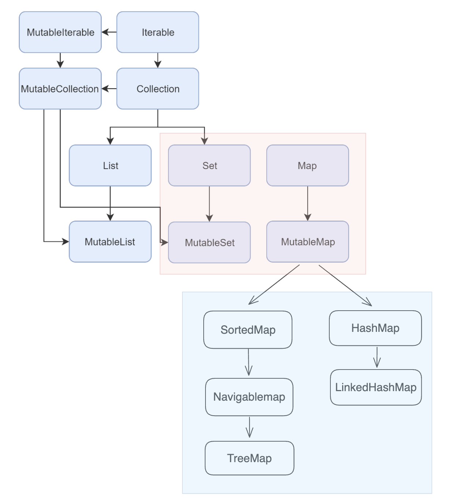

# Atomic Kotlin 26 ~ 30

<details>
  <summary>Collection Hierarchy</summary>



- Red Box : 여기서 배울 Collection들
- Blue Box : 여기선 배우지않지만 다양한 Map의 종류 ([관련링크](https://medium.com/depayse/kotlin-collections-2-map-hashmap-treemap-linkedhashmap-76195842f0c8))

</details>

## Atom26 집합(Set)

- Set의 생성 : 리스트와 마찬가지로 두가지 생성함수 제공

  - `setOf()` → 읽기전용 Set
  - `mutableSetOf()` → 가변 Set

- Set 의 특징

  ```kotlin
  fun main() {
    // 1
    val intSet = setOf(1, 1, 2, 3, 9, 9, 4)
    intSet eq setOf(1, 2, 3, 4, 9)

    // 2
    setOf(1, 2) eq setOf(2, 1)

    // 3
    (9 in intSet) eq true
    (99 in intSet) eq false

    intSet.contains(9) eq true
    intSet.contains(99) eq false

    // 4
    intSet.containsAll(setOf(1, 9, 2)) eq true

    // 5 : 합집합
    intSet.union(setOf(3, 4, 5, 6)) eq
      setOf(1, 2, 3, 4, 5, 6, 9)

    // 6 : 교집합
    intSet intersect setOf(0, 1, 2, 7, 8) eq
      setOf(1, 2)

    // 7 : 차집합
    intSet subtract setOf(0, 1, 9, 10) eq
      setOf(2, 3, 4)
    intSet - setOf(0, 1, 9, 10) eq
      setOf(2, 3, 4)
  }

  ```

  - 중복되지 않는다.
  - 순서가 없다
  - `in`, `contains()`를 통해서 요소인지 여부를 확인할 수 있다.
  - `containsAll()` 를 통해서 Set끼리의 포함여부를 확인할 수 있다.
  - Set의 연산 지원(밴 다이어그램 연산)
    - 합집합(union, +), 교집합(intersect), 차집합(subtract, -)
      - 점표기법 : `set1.union(set2)`
      - 중위표기법 : `set1 union set2`, `set1 + set2`

- 중복제거에서의 Set 활용

  ```kotlin
    fun main() {
      val list = listOf(3, 3, 2, 1, 2)
      list.toSet() eq setOf(1, 2, 3)
      list.distinct() eq listOf(3, 2, 1)
      "abbcc".toSet() eq setOf('a', 'b', 'c')
    }
  ```

  - 리스트에서 집합으로 변경하여 중복을 제거할 수 있다.
    - `toSet()` 이용
  - `distinct()` 를 이용하여 중복을 제거할 수 있다.
    - Array, List에서 사용하여 중복을 제거한 Array 나 List를 반환한다. 단, 순서는 유지된다.
    - Set에서도 distinct() 멤버함수 존재하지만, Set의 특성상 의미없는 멤버함수이다. 단지 Collection 인터페이스에서 상속되어서 있는 것이다.
  - `문자열.toSet()` 을 통해서도 중복을 제거할 수 있다.

  - 위의 내용을 활용한 문자열의 중복을 없애는 또다른 방법
    ```kotlin
      val b = "helloworld".toList()
      val c = b.distinct()
      println(c)
    ```
    > 당연하게도 타입은 다름!

- MutableSet

  - 리스트와 마찬가지로 +/- 연산을 통해서 원소를 추가 삭제가 가능하다.

    ```kotlin
      fun main() {
        val mutableSet = mutableSetOf<Int>()
        mutableSet += 42
        mutableSet += 42
        mutableSet eq setOf(42)
        mutableSet -= 42
        mutableSet eq setOf<Int>()
      }
    ```

<details>
  <summary>참고</summary>

```kotlin
fun main() {
    val list = mutableListOf(1,2,3,4) // o.k
    var list = mutableListOf(1,2,3,4) // o.k
    val list = listOf(1,2,3,4) // val not reassign
    var list = listOf(1,2,3,4) // o.k
    list += 5
    println(list)
    list -= 1
    println(list)
}
```

> [실행링크](https://pl.kotl.in/ij3t9Mgxs)

현상적으로만 따지면, val에 할당하고 읽기전용 생성함수인 listOf로 생성하는 경우에만 연산이 불가능하다.

</details>

## Atom27 맵

> 맵은 키와 값을 연결시켜주기 때문에 이를 `연관 배열(associative array)` 라고 부르기도 한다.

- Map의 생성

  - 키-값 쌍을 mapOf()에 전달
  - 키-값 전달 형식 : `키 to 값`

  ```kotlin
  fun main() {
      val constants = mapOf(
      "Pi" to 3.141,
      "e" to 2.718,
      "phi" to 1.618
    )
    constants eq
      "{Pi=3.141, e=2.718, phi=1.618}"
  }
  ```

- Map의 특징

  ```kotlin
  fun main() {

  // 1) 접근
  constants["e"] eq 2.718
  constants.keys eq setOf("Pi", "e", "phi")
  constants.values eq "[3.141, 2.718, 1.618]"

  // 2) 반복1
  var s = ""
  for (entry in constants) {
    s += "${entry.key}=${entry.value}, "
  }
  s eq "Pi=3.141, e=2.718, phi=1.618,"


  // 3) 반복2
  s = ""
  for ((key, value) in constants)
    s += "$key=$value, "
  s eq "Pi=3.141, e=2.718, phi=1.618,"
  }
  ```

  - 접근

    - `map[특정키]` : 특정 키를 가진 값을 얻을 수 있다.
    - `map.keys` : map의 모든 키를 가져온다.

      → 하나의 map안에서 키는 유일하기 때문에 결국 Set이 생성된다. 실제로 리턴 타입도 Set이다.

      ```kotlin
      public val keys: Set<K>
      ```

    - `map.values` : map의 모든 값을 가져온다.

      ```kotlin
      public val values: Collection<V>
      ```

  - 반복(Iterate)

    - `for (entry in constants)` : for loop
      - `entry.key` : 키
      - `entry.value` : 값
    - `for ((key, value) in constants)` : unpacking for loop
      - key, value 로 직접 접근

- MutableMap

  ```kotlin
    fun main() {
      val m =
        mutableMapOf(5 to "five", 6 to "six")
      m[5] eq "five"

      m[5] = "5ive"
      m[5] eq "5ive"

      m += 4 to "four"
      m eq mapOf(5 to "5ive",
        4 to "four", 6 to "six")
    }
  ```

  - `m[5] = "5ive"` : 기존 5 를 변경할 수 있다.
  - `m += 4 to "four"` : 명시적으로 키와 값을 추가할 수 있다.
  - mapof(), mutableMapOf()는 Map에 전달된 순서를 유지해주지만, 다른 Map(상단의 hierarchy 참고)에서는 순서가 보장되지 않을 수 있다.

- ReadOnlyMap

  ```kotlin
    fun main() {
      val m = mapOf(5 to "five", 6 to "six")
      m[5] eq "five"

      // m[5] = "5ive" // 불가능
      // m += (4 to "four") // 불가능
      m + (4 to "four") // m을 변경할 수 없음
      m eq mapOf(5 to "five", 6 to "six")

      val m2 = m + (4 to "four")
      m2 eq mapOf(
        5 to "five", 6 to "six", 4 to "four")
  }
  ```

  - 읽기전용 Map : 수정, 추가 불가능
  - 읽기전용 Map에서 키-값을 추가하는 방법은 새로운 Map을 생성해야한다.

- 맵의 기본값 설정

  ```kotlin
  fun main() {
    val map = mapOf('a' to "attempt")
    map['b'] eq null

    capture {
      map.getValue('b')
    } eq "NoSuchElementException: " +
      "Key b is missing in the map."

    map.getOrDefault('a', "??") eq "attempt"
    map.getOrDefault('b', "??") eq "??"
  }
  ```

  - Map에서 특정 키로 접근할때, 키에 대한 값이 없으면 null을 반환한다.
  - `getValue()` 멤버함수를 사용하여 접근하면, 값이 없으면 `NoSuchElementException` 를 반환한다.
  - 가장 좋은 방법은 `getOrDefault(key, defaultValue)` 를 사용하는 것이다. 키로 접근할 때, 값이 없으면, 설정된 기본값을 반환한다.

- 클래스 인스턴스를 Map에 저장하는 방법

  ```kotlin
  class Contact(
    val name: String,
    val phone: String
  ) {
    override fun toString(): String {
      return "Contact('$name', '$phone')"
    }
  }

  fun main() {
    val miffy = Contact("Miffy", "1-234-567890")
    val cleo = Contact("Cleo", "098-765-4321")
    val contacts = mapOf(
      miffy.phone to miffy,
      cleo.phone to cleo)
    contacts["1-234-567890"] eq miffy
    contacts["1-111-111111"] eq null
  }
  ```

  - `miffy` 와 `cleo` 인스턴스 생성
  - 각 전화번호에 맞는 인스턴스를 저장할 수 있다.(인스턴스 맵핑)

    → 인스턴스를 키로 사용할 수 있는데, 이 방법은 뒤에서 학습

## Atom28 프로퍼티 접근자

> 클래스 내부에 선언된 프로퍼티에 대한 `getter`와 `setter` 를 어떻게 사용하는지에 대해서 알아본다.

- 프로퍼티 접근

  ```kotlin
    class Data(var i: Int)

    fun main() {
      val data = Data(10)
      data.i eq 10  // get
      data.i = 20   // set
    }
  ```

  - 인스턴스 내부의 프로퍼티를 통해서 `get`과 `set`을 할 수 있다.

- 프로퍼티 접근 커스터마이징

  ```kotlin
  class Default {
    var i: Int = 0
      get() {
        trace("get()")
        return field
      }
      set(value) {
        trace("set($value)")
        field = value
      }
  }

  fun main() {
    val d = Default()
    d.i = 2
    trace(d.i)
    trace eq """
      set(2)
      get()
      2
    """
  }
  ```

  - 클래스 내부에서 프로퍼티 정의 이후에 `getter`와 `setter`를 정의할 수 있다.
  - getter와 setter를 정의하는 순서는 중요하지 않다.
  - getter와 setter 내부에만 존재하는 `field` 라는 이름을 사용해 저장된 값에 직접 접근 가능하다.
  - getter와 setter 안에서 커스터마이징이 가능하다. 위에서는 값을 읽고 쓰는 과정에서 추가 정보가 출력될 수 있도록 만든 것이다.

- private

  ```kotlin
  class Counter {
    var value: Int = 0 // ✅
      private set      // ✅
    fun inc() = value++
  }

  fun main() {
    val counter = Counter()

    // counter.value++

    repeat(10) {
      counter.inc()
    }
    counter.value eq 10
  }
  ```

  - value에 대한 접근자 모두 private 설정 : `private var value: Int = 0`
  - 위 코드는 `getter는 public`이고 `setter는 private` 으로 설정한 것으로 들여쓰기 형식을 맞춰야하는 것으로 보인다.(인텔리제이에서 자동으로 들여쓰기됨)
  - [TEST] `counter.value++` → error : Cannot assign to 'value': the setter is private in 'Counter'

- field를 사용하지 않는 접근자

  ```kotlin
  class Hamster(val name: String)

  class Cage(private val maxCapacity: Int) {
    private val hamsters =
      mutableListOf<Hamster>()

    val capacity: Int
      get() = maxCapacity - hamsters.size
    val full: Boolean
      get() = hamsters.size == maxCapacity

    fun put(hamster: Hamster): Boolean =
      if (full)
        false
      else {
        hamsters += hamster
        true
      }
    fun take(): Hamster =
      hamsters.removeAt(0)
  }

  fun main() {
    val cage = Cage(2)
    cage.full eq false
    cage.capacity eq 2
    cage.put(Hamster("Alice")) eq true
    cage.put(Hamster("Bob")) eq true
    cage.full eq true
    cage.capacity eq 0
    cage.put(Hamster("Charlie")) eq false
    cage.take()
    cage.capacity eq 1
  }
  ```

  - `full` 과 `capacity` 는 내부 프로퍼티 값을 이용해서 getter를 정의하고 있다.

- 리팩토링

  ```kotlin
  class Cage2(private val maxCapacity: Int) {
    private val hamsters =
      mutableListOf<Hamster>()
    fun capacity(): Int =
      maxCapacity - hamsters.size
    fun isFull(): Boolean =
      hamsters.size == maxCapacity
  }
  ```

  - 위에서 `full` 과 `capacity` 를 프로퍼티를 멤버함수로 변경할 수 있다.
  - 프로퍼티 vs 멤버함수??
    - 코틀린 스타일 가이드에서는 계산비용이 많지않고, 객체상태를 변경하지 않는 한 멤버함수보다는 **프로퍼티**를 사용할 것을 추천

## Atom29 : 2부 요약

### 패키지와 테스트

```kotlin
  package com.yoururl.libraryname

  fun f() = "result"
```

- `package` : 재사용이 가능한 라이브러리 컴퍼넌트를 원하는 만큼 묶을 수 있다.

  - 위 코드에서는 1개의 컴퍼넌트(`fun f`)만을 package에서 꺼내서 사용할 수 있다.

- 패키지 이름은 관습적으로 도메인의 이름을 역순으로 하여 사용한다.

  - `yoururl.com` → `com.yoururl`

- 코틀린에서의 패키지 이름은 패키지의 파일시스템에서의 위치와 무관하다.

  - 자바에서는 파일의 위치와 패키지명이 연결되어있다. → `com/yoururl/libraryname`에 위치하게된다.

- `import com.yoururl.libraryname.*` : \* 를 통해서 라이브러리에 속한 모든 컴퍼넌트를 임포트 할 수 있다.

  - 구체적인 이름을 통해서 특정 컴퍼넌트만 임포트할 수 도 있다.

- test는 생략!!

### 객체는 모든 곳에 존재한다

```kotlin
fun main() {
  val lst = listOf(19.2, 88.3, 22.1)
  lst[1] eq 88.3
  lst.reversed() eq listOf(22.1, 88.3, 19.2)
  lst.sorted() eq listOf(19.2, 22.1, 88.3)
  lst.sum() eq 129.6
}
```

- 코틀린은 하이브리드 객체-함수형 프로그래밍 언어이다.

  - 객체 지향과 함수형 지향을 모두 지원

- 객체 중에 가장 유용한 유형 : 컨테이너(`콜렉션`)

  - 콜렉션 : 다른 객체를 담는 객체 → List가 가장 많이 사용된다.
  - `reversed()`, `sorted()` : 리스트 내부의 변화없이 변경된 새로운 리스트를 반환한다.
    - 이런 식으로 원본 객체를 변경하지 않는 접근 방식을 코틀린 라이브러리에서 일관되게 접할 수 있을 것이고, 우리는 이러한 패턴에 맞게 코딩을 해야한다.

### 클래스 만들기

```kotlin
class NoBody

class SomeBody {
  val name = "Janet Doe"
}

class EveryBody {
  val all = listOf(SomeBody(),
    SomeBody(), SomeBody())
}

fun main() {
  val nb = NoBody()
  val sb = SomeBody()
  val eb = EveryBody()
}

```

- 클래스 생성
  - class 키워드, class 이름, 본문 이렇게 정의된다. 이 때 본문은 없을수도 있다.
  - 클래스 내부에는 프로퍼티 정의와 멤버함수 정의가 들어간다.

```kotlin
class Temperature {
  var current = 0.0
  var scale = "f"
  fun setFahrenheit(now: Double) {
    current = now
    scale = "f"
  }
  fun setCelsius(now: Double) {
    current = now
    scale = "c"
  }
  fun getFahrenheit(): Double =
    if (scale == "f")
      current
    else
      current * 9.0 / 5.0 + 32.0
  fun getCelsius(): Double =
    if (scale == "c")
      current
    else
      (current - 32.0) * 5.0 / 9.0
}

fun main() {
  val temp = Temperature()   // [1]
  temp.setFahrenheit(98.6)
  temp.getFahrenheit() eq 98.6
  temp.getCelsius() eq 37.0
  temp.setCelsius(100.0)
  temp.getFahrenheit() eq 212.0
}
```

- 인스턴스 생성시 new 사용하지 않고, `클래스이름([인자])` 형태로 인스턴스를 생성할 수 있다.
- 멤버함수는 클래스 내부에서 정의된다는 점을 제외하고는 클래스 외부에서 정의된 함수와 동일하다. 또한 같은 클래스 내부의 프로퍼티(멤버)에 제한없이 접근이 가능하다.

```kotlin
class Cell {
  var entry = ' '
  fun setValue(e: Char): String =   // ✅
    if (entry == ' ' &&
      (e == 'X' || e == 'O')) {
      entry = e
      "Successful move"
    } else
      "Invalid move"
}

class Grid {
  val cells = listOf(               // ✅
    listOf(Cell(), Cell(), Cell()),
    listOf(Cell(), Cell(), Cell()),
    listOf(Cell(), Cell(), Cell())
  )
  fun play(e: Char, x: Int, y: Int): String =
    if (x !in 0..2 || y !in 0..2)   // ✅
      "Invalid move"
    else
      cells[x][y].setValue(e)       // ✅
}

fun main() {
  val grid = Grid()
  grid.play('X', 1, 1) eq "Successful move"
  grid.play('X', 1, 1) eq "Invalid move"
  grid.play('O', 1, 3) eq "Invalid move"
}
```

- 위 코드는 틱택토의 기본적인 클래스 코드이다.
- 틱택토 보드의 그리드와 그리드 안의 셀을 각각 클래스로 구현하여 그리드 생성시 이중배열(이중리스트)가 생성된다.

- Grid 클래스 멤버함수 play 안에서 각 Cell 클래스의 멤버함수인 setValue가 호출되고, 그 멤버함수 안에서 조건문에 의해 체크된 뒤에 문자열 결과를 반환한다.

- `if(x !in 0..2)` : x 가 0~2에 포함되지 않으면

### 생성자

```kotlin
class Badger(id: String, years: Int) {
  val name = id
  val age = years
  override fun toString(): String {
    return "Badger: $name, age: $age"
  }
}

class Snake(
  var type: String,
  var length: Double
) {
  override fun toString(): String {
    return "Snake: $type, length: $length"
  }
}

class Moose(
  val age: Int,
  val height: Double
) {
  override fun toString(): String {
    return "Moose, age: $age, height: $height"
  }
}

fun main() {
  Badger("Bob", 11) eq "Badger: Bob, age: 11"
  Snake("Garden", 2.4) eq
    "Snake: Garden, length: 2.4"
  Moose(16, 7.2) eq
    "Moose, age: 16, height: 7.2"
}

```

- 생성자 정보를 전달할 때, 파라미터 목록을 생성자 이름 뒤에 `( )`를 통해서 전달한다.

- Badger 클래스

  - 생성자 파라미터를 클래스 본문에서만 사용할 수 있다. 다른 곳에서 참조하고 싶다면, 본문에서 프로퍼티로 할당 후 가능하다.

    ```kotlin
      class Badger(id: String, years: Int) {
        fun change() {
            var name = id  // 🔥 error : Unresolved reference: id
        }

      }
    ```

- Snake 클래스 / Moose 클래스

  - 생성자 파라미터에 `var`, `val` 로 정의하면 파라미터가 바로 프로퍼티로 변경되어 클래스 내부 어디서든 참조가 가능하다.
  - val 는 변경이 불가능, var는 변경이 가능

- override
  - 이미 다른 곳에서 정의되어있는 멤버함수를 재정의하여 사용하고 싶을때 코틀린에서는 명시적으로 override 라는 키워드를 요구한다. → 함수 재정의 목적과 오류 방지의 장점 존재

### 가시성 제한하기

- 코틀린에서 다른 언어와 마찬가지로 접근 변경자를 제공한다. 이를 이용하면 클라이언트단에 공개할 내용을 제어할 수 있다.
- 접근 변경자 종류 : private, public, protected, internal

> 예시1

```kotlin
private var count = 0                   // [1]

private class Box(val dimension: Int) { // [2]
  fun volume() =
    dimension * dimension * dimension
  override fun toString() =
    "Box volume: ${volume()}"
}

private fun countBox(box: Box) {        // [3]
  trace("$box")
  count++                               // ✅
}

fun countBoxes() {
  countBox(Box(4))                      // ✅
  countBox(Box(5))
}
```

- [1]/[2]/[3] : 모두 private이기때문에 파일 내부에서는 접근이 가능하지만, 파일 외부에서는 접근이 불가능하다.

> 예시2

```kotlin
class JetPack(
  private var fuel: Double   // [1]
) {
  private var warning = false
  private fun burn() =       // [2]
    if (fuel - 1 <= 0) {
      fuel = 0.0
      warning = true
    } else
      fuel -= 1
  public fun fly() = burn()  // [3]

  fun check() =              // [4]
    if (warning)             // [5]
      "Warning"
    else
      "OK"
}

fun main() {
  val jetPack = JetPack(3.0)
  while (jetPack.check() != "Warning") {
    jetPack.check() eq "OK"
    jetPack.fly()
  }
  jetPack.check() eq "Warning"
}
```

- [1]/[2] : private 이기때문에 클래스 내부에서만 접근 가능
- [3]/[4] : public 이기때문에 클래스 외부에서 접근 가능

### 예외

- 예외가 던져지면 현재 실행 경로가 중단되고, 예외는 상위 문맥으로 전달된다. 예외를 잡아내지 않으면 프로그램이 중단되면서 자세한 정보를 포함하는 스택 트레이스가 표시된다.
- [책에 대한 내용]

  - `capture()` : 예외를 확인을 위해서 주석을 해제를 반복하는 수고를 덜기위해서, capture함수를 제공한다. 해당 함수의 역할은 예외 발생하는 모습을 캡쳐해서 반환하고 빌드시스템이 예외 출력를 검사할 수 있도록 구현되었다.

- `throw 예외클래스이름(인자)`

  ```kotlin
  class Roots(
    val root1: Double,
    val root2: Double
  )

  fun quadraticZeroes(
    a: Double,
    b: Double,
    c: Double
  ): Roots {
    if (a == 0.0)
      throw IllegalArgumentException(
        "a is zero")
    val underRadical = b * b - 4 * a * c
    if (underRadical < 0)
      throw IllegalArgumentException(
        "Negative underRadical: $underRadical")
    val squareRoot = sqrt(underRadical)
    val root1 = (-b - squareRoot) / (2 * a)
    val root2 = (-b + squareRoot) / (2 * a)
    return Roots(root1, root2)
  }

  fun main() {
    capture {
      quadraticZeroes(0.0, 4.0, 5.0)
    } eq "IllegalArgumentException: " +
      "a is zero"
    capture {
      quadraticZeroes(3.0, 4.0, 5.0)
    } eq "IllegalArgumentException: " +
      "Negative underRadical: -44.0"
    val roots = quadraticZeroes(1.0, 2.0, -8.0)
    roots.root1 eq -4.0
    roots.root2 eq 2.0
  }
  ```

  - 근의 공식 2가지 예외

    - a가 0이 될 수 없다.
      - `throw IllegalArgumentException("a is zero")`
    - b^2 - 4ac 는 음수가 될 수 없다 → b^2 - 4ac >= 0
      - `throw IllegalArgumentException("Negative underRadical: $underRadical")`

  - IllegalArgumentException : 표준예외

  - 예외 타입의 위계

    ```
    Throwable
    ├── Exception
    │   ├── RuntimeException
    │   │   ├── NullPointerException
    │   │   ├── IndexOutOfBoundsException
    │   │   ├── IllegalArgumentException  ✅
    │   │   └── 기타 RuntimeException의 서브클래스들
    │   └── IOException
    │       ├── FileNotFoundException
    │       └── 기타 IOException의 서브클래스들
    └── Error
        ├── OutOfMemoryError
        ├── StackOverflowError
        └── 기타 Error의 서브클래스들
    ```

### 리스트

```kotlin
fun main() {
  val ints = listOf(5, 13, 9)

  // ints.add(11) // ❌

  for (i in ints) {
    if (i > 10) {
      trace(i)
    }
  }

  val chars = mutableListOf('a', 'b', 'c')
  chars.add('d') // ⭕️
  chars += 'e'

  trace(chars)
  trace eq """
    13
    [a, b, c, d, e]
  """
}
```

- 리스트는 순차적인 콜렉션 타입이다.
- listOf()는 읽기전용 리스트(불변리스트)를 생성한다. 그래서 `add()`를 통해서 상태를 변경할 수 없다. for문으로 순회가능하다.
- mutableListOf()는 변경가능한 리스트(가변리스트)를 생성한다. `add()` 나 `+= 연산`을 통해서 리스트의 상태를 변경할 수 있다.

```kotlin
fun main() {
    val first = mutableListOf(1)
    val second: List<Int> = first
    second eq listOf(1)
    first += 2

    // second += 2  // ✅ 이렇게 변경할 수 없음

    // second sees the change:
    second eq listOf(1, 2)
}
```

- [책_p183] `읽기전용 리스트는 결과 내부를 변경할 수 없는 불변 리스트와는 다르다` 라고 표현

  - 여기서 말하는 읽기전용 리스트는 listOf()에 의해서 생성된 리스트를 말하는 것이 아니고 진짜 "읽기전용"으로 사용하는 리스트를 말하는 것이고, 불변리스트는 listOf()로 생성된 것을 말한다고 이해했다. 코드를 보면 좀 더 이해할 수 있다.

- 코드 살펴보기

  - first : 가변리스트
  - second : first의 참조값을 지니고 있지만, `List<Int>` 로 선언되어서 타입상 읽기 전용 리스트가 되었기때문에 직접 변경이 불가능하다.
  - first는 변경 가능하기 때문에 first를 변경하면 이와 같은 참조값을 가지 second도 변경이 된다.

    → 그래서 second는 `읽기 전용뷰`를 제공하는 리스트가 된다. 이런 의미에서 읽기전용 리스트와 불변 리스트가 다르다고 표현한 것이라고 이해하였다.

```kotlin
fun main() {
  val wocky = """
    Twas brillig, and the slithy toves
      Did gyre and gimble in the wabe:
    All mimsy were the borogoves,
      And the mome raths outgrabe.
  """.trim().split(Regex("\\W+"))

  trace(wocky.take(5))
  trace(wocky.slice(6..12))
  trace(wocky.slice(6..18 step 2))
  trace(wocky.sorted().takeLast(5))
  trace(wocky.sorted().distinct().takeLast(5))

  trace eq """
    [Twas, brillig, and, the, slithy]
    [Did, gyre, and, gimble, in, the, wabe]
    [Did, and, in, wabe, mimsy, the, And]
    [the, the, toves, wabe, were]
    [slithy, the, toves, wabe, were]
  """
}
```

- `split(Regex("\\W+"))` : wocky를 공백 및 , 등으로 이루어진 문자를 기준으로 자르면 문자로 이루어진 리스트를 반환한다.

  - 결과값 : `[Twas, brillig, and, the, slithy, toves, Did, gyre, and, gimble, in, the, wabe, All, mimsy, were, the, borogoves, And, the, mome, raths, outgrabe]`

- take(), slice(), sorted(), takeLast(), distinct() : **모두 새로운 리스트를 반환**한다.
  - take(n) : 앞에서 n개까지 리스트 반환
  - slice(구간) : 구간에 일치하는 새로운 리스트 반환
  - sorted() : 정렬된 새로운 리스트 반환
    - sort() : MutableList에서만 작동, 원본리스트 변경
  - takeLast(n) : 뒤에서 n개까지 포함된 리스트 반환
  - distinct() : 중복된 요소를 제거된 리스트 반환

### 파라미터화한 타입

```kotlin
fun main() {
  val numbers: List<Int> = listOf(1, 2, 3)
  val strings: List<String> =
    listOf("one", "two", "three")
  numbers eq "[1, 2, 3]"
  strings eq "[one, two, three]"
  toCharList("seven") eq "[s, e, v, e, n]"
}

fun toCharList(s: String): List<Char> =
  s.to
```

- 컨네이너(콜렉션) 안의 담기는 타입이 무슨 타입인지를 적어주는 것을 **타입 파라미터**라고 한다.
  - `List<Int>` : Int의 List → List of Int
  - `List<String>` : String의 List → List of String

### 가변인자 목록

```kotlin
fun varargs(s: String, vararg ints: Int) {
  for (i in ints) {
    trace("$i")
  }
  trace(s)
}

fun main() {
  varargs("primes", 5, 7, 11, 13, 17, 19, 23)
  trace eq "5 7 11 13 17 19 23 primes"
}
```

- vararg 키워드 : 가변인자목록을 뜻하는 말(var + arg)로 함수가 같은 타입의 인자를 받게 해주는 것을 말한다.
- vararg는 Array 타입이다. 함수 정의에서 vararg는 최대 하나만 지정할 수 있고, 일반적으로 마지막 파라미터를 vararg로 지정한다.(다른 위치에 있어도 지정 가능)

```kotlin
fun main() {
  val array = intArrayOf(4, 5)      // [1]
  varargs("x", 1, 2, 3, *array, 6)  // [2]
  val list = listOf(9, 10, 11)
  varargs(
    "y", 7, 8, *list.toIntArray())  // [3]
  trace eq "1 2 3 4 5 6 x 7 8 9 10 11 y"
}
```

- `*` 스프레드 연산자(펼침 연산자)를 통해서 파라미터로 Array를 전달할 수 있다.
- [3] : `*list.toIntArray()`
  - list를 toIntArray()에 의해서 Array 타입으로 변환한다.
  - 연산자로 펼쳐서 `9,10,11`로 전달하게 된다.

### 집합 / 맵 / 프로퍼티 연산자

> 앞에서 했던 부분이라 생략...🥲

## Atom30 확장 함수

- 확장 함수(extension function) 정의

  ```kotlin
  fun String.singleQuote() = "'$this'"
  fun String.doubleQuote() = "\"$this\""

  fun main() {
    "Hi".singleQuote() eq "'Hi'"
    "Hi".doubleQuote() eq "\"Hi\""
  }
  ```

  - 기존 클래스에서 멤버 함수를 추가하는 것과 같은 효과를 내는 함수를 확장 함수라고 한다. 그래서 마치 기존 클래스의 멤버 함수처럼 호출해서 사용할 수 있다.

  - `fun 수신타입.확장함수() { .... }`

    - 정의에서 적힌 **수신타입** 이란 : 확장할 대상 타입을 의미하고, 수식 객체 타입(receiver type)이라고 부른다.

- 임포트 방법

  ```kotlin
    import atomictest.eq
    import extensionfunctions.doubleQuote // ✅
    import extensionfunctions.singleQuote // ✅

    fun main() {
      "Single".singleQuote() eq "'Single'"
      "Double".doubleQuote() eq "\"Double\""
    }
  ```

- 확장 함수에서의 this

  ```kotlin
    fun String.strangeQuote() =
      this.singleQuote().singleQuote()

    fun String.tooManyQuotes() =
      doubleQuote().doubleQuote() // ✅

    fun main() {
      "Hi".strangeQuote() eq "''Hi''"
      "Hi".tooManyQuotes() eq "\"\"Hi\"\""
    }
  ```

  - 클래스 내부에서 this를 생략가능한 것과 마찬가지로 확장 함수에서도 생략 가능

- 확장 함수의 장점 : 간단한 코드 생성

  ```kotlin
    class Book(val title: String)

    fun Book.categorize(category: String) =
      """title: "$title", category: $category"""

    fun main() {
      Book("Dracula").categorize("Vampire") eq
        """title: "Dracula", category: Vampire"""
    }
  ```

  - 확장 함수는 수신 객체 타입의 프로퍼티가 public인 경우에만 접근이 가능하다.
  - `class Book(private val title: String)` : error 발생 (`Cannot access 'title': it is private in 'Book'`)

  - 정말 간결하니?? : 음...🤔

    > 확장함수를 사용하지 않는 같은 결과를 얻어내는 코드

    ```kotlin
      class Book(val title: String) {

          fun categorize(category: String) =
              """title: "$title", category: $category"""
      }

      fun main() {
          val book = Book("Dracula")
          book.categorize("Vampire") eq
                  """title: "Dracula", category: Vampire"""
      }
    ```

- 확장함수 유무 비교 (feat.chatGPT)

  - 확장함수를 사용하지 않은 것

    ```kotlin
    fun capitalizeFirstLetter(str: String): String {
        if (str.isEmpty()) return str
        return str.substring(0, 1).uppercase() + str.substring(1)
    }

    fun main() {
        val strings = listOf("hello", "world", "kotlin")
        val capitalizedStrings = strings.map { capitalizeFirstLetter(it) }

        println(capitalizedStrings) // [Hello, World, Kotlin]
    }
    ```

  - 확장함수를 사용한 것

    ```kotlin
    // String 타입에 대한 확장 함수 정의
    fun String.capitalizeFirstLetter(): String {
        if (this.isEmpty()) return this
        return this.substring(0, 1).uppercase() + this.substring(1)
    }

    fun main() {
        val strings = listOf("hello", "world", "kotlin")
        val capitalizedStrings = strings.map { it.capitalizeFirstLetter() }

        println(capitalizedStrings) // [Hello, World, Kotlin]
    }
    ```

    - 가독성 향상: 기존 클래스의 메서드를 호출하는 것처럼 코드가 자연스럽고 읽기 쉽다.
      - `it.capitalizeFirstLetter()`
    - 캡슐화: 확장 함수를 통해 특정 클래스에 관련된 동작을 해당 클래스 내부로 캡슐화 할 수 있다. 이는 코드의 응집도를 높이고, 다른 곳에서 재사용할 때 유용하다.
    - ~~코드 중복 감소: 여러 곳에서 동일한 작업을 수행해야 하는 경우, 확장 함수를 사용하면 코드 중복을 줄일 수 있다. 필요할 때마다 별도의 함수를 import하여 사용하는 대신, 확장 함수로 정의된 메서드를 호출하면 된다.~~
    - 기존 코드 수정 불필요: 확장 함수는 기존 클래스나 라이브러리를 수정하지 않고도 새로운 기능을 추가할 수 있게 한다. 이는 외부 라이브러리나 서드파티 코드를 사용할 때 특히 유용할 수 있다.
