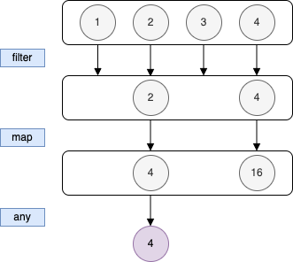
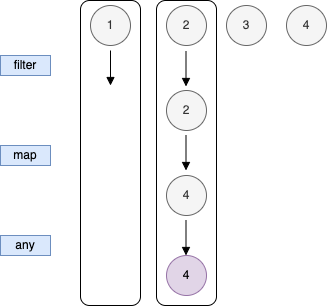
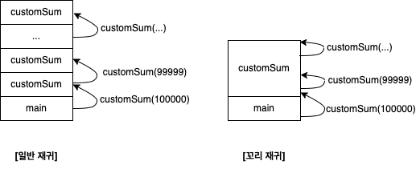

# 아토믹 코틀린 (51~55)
---
## 51. 시퀀스
#### [ 시퀀스 (Sequence) ]
- 이터레이션 수행 가능. (인덱스 써서 시퀀스 원소에 접근 가능)
  - 다른 함수형 언어에서는 stream 이라고 함 (Java8 의 Stream 라이브러리와 호환성을 유지하기 위해 코틀린은 `Sequence` 라고 이름을 정했다고 함)
- list 에 대한 연산은 즉시 계산 → 함수를 호출하자마자 모든 원소에 대해 바로 게산이 이루어짐
  - 아래 예제와 같이 list 연산을 연쇄시키면 첫 번째 연산의 결과가 나온 후에 다음 연산을 적용할 수 있음
  - 컬렉션 함수를 연쇄하면 매 단계마다 계산 중간 결과를 새로운 컬렉션에 임시로 담는다는 의미
```kotlin
fun main() {
  val  list = listOf(1, 2, 3, 4)
  list.filter { it % 2 == 0}
    .map { it * it }
    .any { it < 10 } eq true

  
  val mid1 = list.filter { it % 2 == 0}
  mid1 eq listOf(2, 4)
  val mid2 = mid1.map { it * it }
  mid2 eq listOf(4, 14)
  mid2.any { it < 10 } eq true
}
```

- 즉시 계산의 견우, 직관적이고 단순하지만 합리적이지 않을 수 있음
  - 즉시 계산 = 수평적 평가
  - 위의 이미지 참고) 현재 수평적 수준에 잇는 모든 원소에 대해 연산이 처리되어야 다음 연산을 처리할 수 있음


- 이에 대안으로 제시되는 것이 지연 계산 → 수직적 평가
- 결과가 필요할 때만 계산을 수행하는 것으로, 어떤 원소와 연관된 값이 진짜 필요할 때만 그 원소와 관련된 연산을 수행한다.
- 원본 컬렉션의 마지막 원소를 처리하기 전에 최종 결과를 찾아내면 나머지 원소를 처리되지 않음
- Sequence 는 (중간) 연산을 저장해두기 때문에 각 연산을 원하는 순서로 호출할 수 있고, 그에 따라 지연 계산이 발생하는 원리

- List를 `asSequence()` 를 사용해 Sequence 로 변경하면 지연 게산을 활성화 할 수 있음
```kotlin
fun Int.isEven(): Boolean {
  trace("$this.isEvent()")
  return this % 2 == 0
}

fun Int.square(): Int {
  trave("$this.square()")
  return this * this
}

fun Int.lessThanTen(): Boolean {
  trace("$this.lessThanTen()")
  return this < 10
}

fun main(){
  val list = listOf(1, 2, 3, 4)
  trace(">>> List:")
  trace(
      list
        .filter(Int::isEvent)
        .map(Int::square)
        .any(Int::lessThanTen)
  )
  trace(">>> Sequence:")
  trace(
      list.asSequence()  // 지연 계산 활성화
        .filter(Int::isEvent)
        .map(Int::square)
        .any(Int::lessThanTen)
  )

  // 출력 결과
  trace eq """
      >>> List:
      1. isEven()
      2. isEven()
      3. isEven()
      4. isEven()
      2. square()
      4. square()
      4. lessThanTen()
      true
      >>> Sequence
      1. isEven()
      2. isEven()
      2. square()
      4. lessThanTen() 
      true
  """
}
```
- List 쪽이 더 많은 원소에 대해 연산을 수행
  - filter 나 map() 을 sequence 에 대해 호출할 경우, 다른 sequence 가 생기며 계산 결과를 요청하기 전까지는 연산에 대한 정보만 저장해놓고 실행하지 않는다.
  - 즉, 필요할 때만 저장해둔 연산을 실행.)

#### [ 중간 연산(intermediate), 최종 연산(terminal) ]
- sequence 는 중간 연산과 최종 연산 두 가지 종류로 나뉨
  - 중간 연산 : 결과로 다른 sequence 를 내어놓음. filter() 와 map()은 중간 연산
  - 최종 연산 : sequence 가 아닌 값을 내어놓음. 결괏값을 얻기 위해 최종 연산은 저장된 모든 계산을 수행
    - 앞의 예에서는 any() 의 sequence 를 받아 boolean 을 내놓는 것이 최종 연산
- 아래는 sequence 를 list 로 변환하며 시퀀스를 처리하는 과정에서 저장된 모든 연산을 실행하는 예시
  - 시퀀스는 연산을 저장해두기때문에 각 연산을 원하는 순서로 호출할 수 있고, 그에 따라 지연 계산이 발생
```kotlin
fun main() {
  val  list = listOf(1, 2, 3, 4)
  tarce(list.asSequence()
    .filter(Int::isEven)
    .map(Int::square)
    .toList()
  )

  trace eq """
      1. isEven()
      2. isEven()
      2. square()
      3. isEven()
      4. isEven()
      4. square()
      [4, 16]
  """
}   
```

#### [ 기타 표준 라이브러리 함수 - generateSequence ]
- `generateSequence()` 는 자연수로 이루어진 무한 시퀀스를 생성
  - 첫 번째 인자는 시퀀스의 첫 번째 원소이고, 두 번째 인자는 이전 원소로부터 다음 원소를 만들어내는 방법을 정의하는 람다
  - Collection 은 size 프로퍼티를 통해 미리 크기를 알 수 있지만, Sequence 는 무한이므로 `take()` 를 통해 원하는 개수만큼 원소를 얻은 후 최종 연산을 수행
```kotlin
fun main() {
  val naturalNumbers = generateSequence(1) { it + 1 }
  naturalNumbers.take(3).toList() eq listOf(1, 2, 3)
  naturalNumbers.take(10).sum() eq 55
}
```
- 시퀀스의 첫 번째 원소인 첫 번째 인자를 요구하지 않고 Sequence 의 다음 원소를 반환하는 람다만 받는 `generateSequence()` 오버로딩 버전도 있음
  - 아래 예제에서는 XXX 가 나타날때까지 Sequence 원소를 생성
```kotlin
fun main() {
  val items = mutableListOf("first", "second", "third", "XXX", "4th")
  // removeAt(0) 은 List 의 첫 번째 원소를 제거한 후 제거한 원소를 반환함
  // takeIf() 는 수신 객체(removeAt(0) 이 반환한 String) 가 Predicate 를 만족하면 수신 객체를 반환하고, 만족하지 않으면 null 반환
  val seq = generateSequence { items.removeAt(0).takeIf { it != "XXX" } }
  seq.toList() eq "[first, second, third]"
  capture {
      seq.toList()
  } eq "IllegalStateException: This " + "Sequence can ve consumed only once."
}
```

#### [ 제네릭 takeIf() ]
- 아래는 타입 파라메터 T 를 사용하여 임의의 타입에 적용할 수 있는 제네릭 takeIf() 의 구현
- takeIf() 대신 if 문을 사용할 수도 있지만 식별자가 추가로 필요하기 때문에 takeIf() 가 가독성이 더 좋음
  - takeIf() 가 좀 더 함수형 표현이며, 호출 연쇄 중간에 자연스럽게 사용할 수 있음 
```kotlin
fun <T> T.takeIf(predicate: (T) -> Boolean): T? {
  return if (predicate(this)) this else null
}

fun main() {
  println("abc".takeIf { it != "XXX" }) // abc
  println("XXX".takeIf { it != "XXX" }) // null
}
```
```kotlin
fun main() {
  generateSequence(6) { 
      ( it -1 ).takeIf { it > 0}
  }.toList() eq ListOf(6, 5, 4, 3, 2, 1)
}
```
---
## 52. 지역 함수
- 다른 함수 안에 정의된 이름 붙은 함수를 지역 함수라 칭함
- 반복되는 코드를 지역함수로 추출하면 중복을 줄일 수 있음
- 지역 함수는 클로저(`Closure`) → 자신이 둘러싼 환경의 var 이나 val 을 포획(capture) 함
  - 포획을 쓰지 않으면 주변 환경의 값을 별도 param 으로 전달 받아야 함
  - 예를 들어 log() 는 자신을 둘러싼 외부 환경의 logMsg를 사용하고, 그렇기떄문에 log() 를 호출할 때 반복적으로 logMsg 를 전달할 필요가 없음
```kotlin
fun main() {
  val logMsg = StringBuilder()
  fun log(message: String) = logMsg.appendLine(message)
  
  log("Starting computation")
  
  val x = 42
  log("Computing result : $x")
  
  logMsg.toString() eq """
    Starting computation
    Computing result : 42
  """
}
```
  
#### [ 지역 확장 함수 ]
- main 안에서만 exclaim 을 사용할 수 있음
```kotlin
fun main() {
  fun String.exclaim() = "$this!"
  "Hello".exclaim() eq "Hello!"
  "Bonjour".exclaim() eq "Bongjour!"
}
```

#### [ 함수 참조를 사용한 지역 함수 참조 ]
```kotlin
class Session(
  val title: String,
  val speaker: String,
)

val sessions = listOf(Session("Kotlin Coroutines", "Roman Elizarov"))

val favoriteSpeakers = setOf("Roman Elizarov")
```
```kotlin
fun main() {
  fun interesting(session: Session): Boolean {
      if (session.title.contains("Kotlin") && session.speaker in favoriteSpeakers) {
          return true
      }
      return false
  }
  
  session.any(::interesting) eq true  //atom 47. 멤버 참조 참고
}
```

#### [ 익명 함수 ]
- 위의 코드의 interesting() 은 한 번만 사용되기 때문에 함수가 아닌 람다로 정의하는 것이 나을 수 있을까? → interesting() 안에서 사용된 return 때문에 람다로 정의가 어려움
- 이 때 사용하는 것이 `익명 함수`
  - 익명 함수는 람다처럼 이름이 없음
  - 지역 함수와 비슷하지만 fun 키워드를 사용하여 함수 정의
```kotlin
fun main(){
  val result = 
      session.any(
          fun(session: Session): Boolean{
              return session.title.contains("Kotlin") && session.speaker in favoriteSpeakeres
          },
      )
  
  println(result)
}
```

#### [ 레이블 (Label) ]
```kotlin
fun main(){
  val list = listOf(1, 2, 3, 4, 5)
  val value = 3
  var result = ""
  
  list.forEach{ // return 을 포함하는 람다
    result += it
    if (it == value) {
        return  // 여기서 return 은 main() 을 끝냄
    }
  }
  println(result)  // 람다 내의 포함된 return 이 main() 을 끝냈기 때문에 출력 x
}
```
- return 은 fun 을 사용해 정의한 함수를 끝내기 떄문에 위의 예시에서 return 은 main() 을 끝냄
- `람다 안에서 return`
  - 코틀린 람다 안에서는 return 을 쓸 수 없지만, 인라인 함수가 람다를 인자로 받는 경우 해당 람다도 함께 인라인하게 되어 있음 → 이때 함께 인라인 되는 람다 안에서 return 을 쓸 수 있도록 허용
  - 인라인을 사용하면 forEach() 함수와 그 함수에 전달된 람다 내용 모두 forEach()를 호출한 위치 (예제의 main()) 에 소스 코드를 복사한 것과 같이 컴파일 됨
    - 람다 안에서 return 을 써도 컴파일 된 코드에서는 main() 함수 본문 내에서 썼는지 아닌지 구분이 안됨 → 똑같이 main() 이 반환
- **람다를 둘러싼 함수가 아니라 람다 안에서만 반환해야 하는 경우 Label 이 붙은 return 을 사용**
  - 아래 코드에서 label 은 람다를 호출한 함수 이름
  - `return@forEach` → label 이 붙은 return 문은 람다를 label 인 forEach 까지만 반환하라고 지정 
```kotlin
fun main(){
  val list = listOf(1, 2, 3, 4, 5)
  val value = 3
  var result = ""

  list.forEach{ // return 을 포함하는 람다
    result += it
    if (it == value) {
      return@forEach  // label이 붙은 return
    }
  }
  result eq "12345" // 12345
}
```
- 람다 앞에 `레이블@` 을 넣으면 새 label 을 만들 수 있으며, 이름은 아무것이나 사용 가능
```kotlin
fun main(){
  val list = listOf(1, 2, 3, 4, 5)
  val value = 3
  var result = ""
    
  // 람다 앞에 커스텀 레이블 붙임 (customName)
  list.forEach customName@{
    result += it
    if (it == value) {
      return@customName
    }
  }
  result eq "12345" // 12345
}
```

#### [ 지역 함수 조작 ]
- var, val 을 사용하여 람다나 익명 함수를 지정할 수 있고, 람다를 가리키게 된 식별자를 사용하여 해당 함수를 호출할 수 있다.
- 아래 예시
  - main() 은 각 함수가 원하는 타입의 함수에 대한 참조를 반환하는지 검증한 후 적절한 인자를 사용하여 각 funRef 를 호출함
  - 각 함수를 호출하여 반환되는 함수 참조 뒤에 인자 목록을 붙이는 방식으로 함수를 호출
```kotlin
// 익명 함수 반환
fun first(): (Int) -> Int { 
    val func = fun(i: Int) = i + 1
    return func  
}

// 람다 반환
fun second(): (String) -> String {
    val func2 = {s: String -> "$s!!"}
  return func2
}

// 지역 함수에 대한 참조 반환
fun third(): () -> String {
    fun func3() = "Hi!"
    return ::func3
}

// third() 와 같으나, 간결하게 수정
fun forth() = fun() = "Hi!"


// 람다를 식 본문 함수에 사용
fun fifth() = { "Hi!" }

fun main() {
  val funRef1: (Int) -> Int = first()
  val funRef2: (String) -> String = second()
  val funRef3: () -> String = third()
  val funRef4: () -> String = forth()
  val funRef5: () -> String = fifth()

  funRef1(42) eq 43
  funRef2("xyz") eq "xyz!"
  funRef3() eq "Hi!"
  funRef4() eq "Hi!"
  funRef5() eq "Hi!"

  // first() 를 호출하면 함수가 반환되기 때문에 인자목록 (43) 추가하려 반환된 함수 호출
  first()(42) eq 43
  second()("xyz") eq "xyz!"

  // 컴파일 오류
  // Function 'func3' (JVM signature: third$func3()Ljava/lang/String;) not resolved in class kotlin.jvm.internal.Intrinsics$Kotlin: no members found
  // third()
  
  third()() eq "Hi!"
  fourth()() eq "Hi!"
  fifth()() eq "Hi!"
}
```
---
## 53. 리스트 접기

#### [ fold() ]
- `fold()` 는 리스트의 모든 원소를 순서대로 조합하여 결과값을 하나로 만들어줌
- `sum()` 이나 `reverse()` 등 도 `fold()` 를 사용하여 구현
```kotlin
fun main() {
  val list = listOf(1, 10, 100, 1000)
  list.fold(0) { sum, n -> sum + n } eq 1111
}
```
- `fold()` 는 첫 번째 인자로 초기값을 받고, 두 번째 인자로 지금까지 누적된 값을 받음 → 현재 원소에 대한 연산을 연속적으로 적용
  - `fold()`를 for 문과 같이 구현하면 아래와 같음
```kotlin
fun main() {
  val list = listOf(1, 10, 100, 1000)
  var accumulator = 0
  val operation =
    { sum: Int, i: Int -> sum + i }
  for (i in list) {
    accumulator = operation(accumulator, i)
  }
  accumulator eq 1111
}
```

#### [ fold() vs foldRight() ]
- `fold()` 는 원소를 왼쪽에서 오른쪽으로 처리하고, foldRight() 는 오른쪽에서 왼쪽으로 처리
- 둘 함수에 전달되는 람다에서 누적값이 전달되는 위치도 다름
- 아래 예시 참고
  - 연산 순서를 보면 `fold()` 는 "a" 를 처음으로 연산에 적용 / `foldRight()`는 "d" 를 처음으로 연산에 적용
```kotlin
fun main() {
  val list = listOf('a', 'b', 'c', 'd')
  list.fold("*") { acc, elem -> "($acc) + $elem" } eq "((((*) + a) + b) + c) + d"
  list.foldRight("*") { elem, acc -> "$elem + ($acc)" } eq "a + (b + (c + (d + (*))))"
}
```

#### [ reduce() vs reduceRight() ]
- fold() 와 foldRight() 는 첫 번째 파라메터를 통해 명시적으로 누적값을 받음
- 첫 번째 원소가 누적값의 초기값이 될 수 있는 경우도 있는데 reduce() 와 reduceRight() 는 각각 첫 번째 원소와 마지막 원소를 초기값으로 사용
```kotlin
fun main() {
  val chars = "A B C D E".split(" ")
  chars.fold("*") { acc, e -> "$acc $e" } eq "* A B C D E"
  chars.foldRight("*") { e, acc -> "$acc $e" } eq  "* E D C B A"
  chars.reduce { acc, e -> "$acc $e" } eq  "A B C D E"
  chars.reduceRight { e, acc -> "$acc $e" } eq "E D C B A"
}
```

#### [ runningFold(), runningReduce() ]
- `runningFold()`와 `runningReduce()` 는 계산되는 모든 중간 단계에서, 중간 계산 값을 포함한 List 를 생성한다.
  - 결과는 동일
```kotlin
fun main() {
  val list = listOf(11, 13, 17, 19)
  list.fold(7) { sum, n ->  sum + n } eq 67
  list.runningFold(7) { sum, n ->  sum + n } eq "[7, 18, 31, 48, 67]"
  
  list.reduce { sum, n -> sum + n } eq 60
  list.runningReduce { sum, n -> sum + n } eq "[11, 24, 41, 60]"
}
```

---
## 54. 재귀

- 재귀는 함수 안에서 함수 자신을 호출하는 기법
- tail recursion (꼬리 재귀) 는 일부 재귀 함수에 명시적으로 적용할 수 있는 최적화 방법
- 재귀 함수는 이전 재귀 호출의 결과를 활용 → 팩토리얼 (n!) 이 일반적인 예시
  - factorial(1) = 1 → factorial(n) = n * factorial(n-1)
```kotlin
fun factorial(n: Long): Long {
    if (n <= 1) return 1
    return n * factorial(n-1)
}

fun main() {
    factorial(5) eq 120
}
``` 
- 함수를 호출하면 함수와 인자에 대한 정보가 호출 스택에 저장
  - 예외 발생 시 스택 트레이스를 통해 호출 스택을 볼 수 있음
  - 스택 트레이스는 예외가 던져진 순간의 호출 스택 상태를 보여주는데, 아래의 경우 호출 스택은 main, failFunc, illegalFunc 세 개의 함수로 구성됨
```kotlin
fun illegalState() {
  // throw IllegalStateException()
}

fun fail() = illegalState()

fun main() {
  fail()
}

//Exception in thread "main" java.lang.IllegalStateException
//at assu.study.kotlinme.chap04.recursion.CallStackKt.illegalFunc(CallStack.kt:5)
//at assu.study.kotlinme.chap04.recursion.CallStackKt.failFunc(CallStack.kt:8)
//at assu.study.kotlinme.chap04.recursion.CallStackKt.main(CallStack.kt:11)
```
- 재귀 함수를 호출하면 매 재귀 함수 호출이 호출 스택에 프레임을 추가 → 이로 인해 호출 스택을 너무 많이 사용하여 더 이상 스택에 쓸 수 있는 메모리가 없다는 `StackOverFlowError` 가 발생하기 쉬움
  - 재귀 함수가 계속 자신을 호출하면서 스택을 채우기 떄문에 `StackOverflowError` 발생 → 이를 `무한 재귀` 라고 함
  - 무한 재귀는 항상 `StackOverflowError` 로 끝남
```kotlin
//  무한 재귀 예시
fun recurse(i: Int): Int = recurse(i + 1)

fun main() {
//    println(recurse(1))
}

//Exception in thread "main" java.lang.StackOverflowError
//at assu.study.kotlinme.chap04.recursion.InfiniteRecursionKt.recurse(InfiniteRecursion.kt:4)
//at assu.study.kotlinme.chap04.recursion.InfiniteRecursionKt.recurse(InfiniteRecursion.kt:4)
//...
//at assu.study.kotlinme.chap04.recursion.InfiniteRecursionKt.recurse(InfiniteRecursion.kt:4)
```
- 무한 재귀 아니더라도 재귀 호출을 아주 많이 하면 동일한 에러 발생할 수 있음
```kotlin
fun sum1(n: Long): Long {
  if (n == 0L) return 0
  return n + customSum(n - 1)
}

fun main() {
  sum1(2) eq 3
  sum1(1000) eq 500500
  // 계산이 끝나는데 아주 오래 걸리고, 재귀 호출에서 결국 StackOverflowError 발생
  // sum(100_000) rq 500050000

  // 위와 비교하기 위해 범위의 합계를 구해주는 표준 라이브러리 함수 sum() 사용, 이 때는 정상적인 값을 내놓음
  (1..100_000L).sum() eq 5000050000
}
```

#### [ 재귀로 인한 StackOverflowError 대응 ]
- 재귀 대신 이터레이션을 사용
- 아래 예시의 경우 sum() 의 호출은 한 번만 이뤄지고, 나머지는 for loop 를 통해 계산 → `StackOverflowError` 가 발생할 위험은 없음
  - 하지만 가상 상태 변수(var) 를 사용해 변하는 값을 저장해야 하는데, 함수형 프로그래밍에서는 가변 상태를 가능하면 피하는 것이 좋음
```kotlin
fun sum2(n: Long): Long {
  var accumulator = 0L
  for (i in 1..n) {
    accumulator += i
  }
  return accumulator
}

fun main() {
  sum2(10000) eq 50005000
  sum2(100000) eq 5000050000
}
```

#### [ tail recursion (꼬리 재귀): tailrec ]
- 함수형 언어들은 꼬리 재귀(tail recursion) 기법을 사용
  - tail recursion 의 목표는 호출 스택의 크기를 줄이는 것
  
- tail recursion 은 `tailrec` 키워드를 사용하여 만듦
  - `tailrec` 는 올바른 조건하에서 재귀 호출을 이터레이션으로 변환하여 호출 스택 비용을 줄여줌
  - 하지만 모든 재귀 함수에 적용할 수 있는 것은 아님 → 재귀가 마지막 연산이어야 함
  - 재귀 함수가 자기 자신을 호출하여 얻은 결과값을 아무 연산도 하지 않고 즉시 반환해야한다는 의미
  - 위의 예시 중 sum1() 앞에 tailrec 을 붙이면 아래와 같은 오류가 생김 → 호출한 결과를 반환하기 전에 n 을 더하고 있는 것이 문제 / 호출 결과에 대해 아무것도 하지 않고 반환해야함 
    - A function is marked as tail-recursive but no tail calls are found: 함수를 꼬리 재귀로 표시했지만 실제 함수 본문에는 꼬리 재귀 호출이 없음
    - Recursive call is not a tail call: 재귀 호출이 꼬리 재귀 호출이 아님 
```kotlin
// accumulator 파라마터를 추가하면 재귀 호출 중에 (인자 계산 시) 덧셈 가능
// 결과를 받으면 그냥 반환하는 일 말고는 또다른 연산이 없음
// 모든 연산을 재귀 함수 호출에 위임하기 때문에 tailrec 가능
// acc 가 불변값이 되므로 가변 상태의 변수도 사라짐
private tailrec fun sum(
  n: Long,
  accumulator: Long
): Long =
  if (n == 0L) accumulator
  else sum(n - 1, accumulator + n)

fun sum(n: Long) = sum(n, 0)

fun main() {
  sum(2) eq 3
  sum(10000) eq 50005000
  sum(100000) eq 5000050000
}
```

#### [ 피보나치 수열을 이용한 일반 재귀와 꼬리 재귀의 차이 ]
- 일반 재귀로 표현한 피보나치
  - 계산한 값을 재사용하지 않기 떄문에 연산 횟수가 기하 급수적으로 늘어나서 비효율적
```kotlin
// 일반 재귀로 표현한 피보나치
fun fibonacci(n: Long): Long {
    return when (n) {
        0L -> 0
        1L -> 1
        else -> fibonacci(n - 1) + fibonacci(n - 2)
    }
}

fun main() {
    println(fibonacci(0))   // 0
    println(fibonacci(22))  // 17711
}
```
- 꼬리 재귀를 사용한 피보나치
```kotlin
// fibonacci(n) 가 Local 함수로 선언된 tail recursion 함수인 fibonacciRec() 을 가려주기 때문에
// 외부에서는 오직 fibonacci(n) 만 호출 가능
fun fibonacci(n: Int): Long {
  tailrec fun fibonacciRec(
    n: Int,
    current: Long,
    next: Long
  ): Long {
    if (n == 0) return current
    return fibonacciRec(
      n - 1, next, current + next)
  }
  return fibonacciRec(n, 0L, 1L)
}

fun main() {
  (0..8).map { fibonacci(it) } eq
          "[0, 1, 1, 2, 3, 5, 8, 13, 21]"
  fibonacci(22) eq 17711
  fibonacci(50) eq 12586269025
}
```
---
# 5부. 객체 지향 프로그래밍
## 55. 인터페이스
- class 키워드 대신 interface 키워드를 사용해 만듦
  - 어떤 인터페이스를 구현하는 클래스를 정의하려면, 클래스 이름 뒤에 콜론(:) 과 인터페이스 이름을 넣으면 됨
- 코틀린 인터페이스 내에는 추상 메서드 뿐 아니라 구현이 있는 메서드도 정의가 가능
  - 단, 상태 필드가 들어갈 수 업승ㅁ
- 자바처럼 클래스는 인터페이스를 원하는 만큼 구현할 수 있지만, 클래스는 오직 하나만 확장할 수 있음
- 특정 인터페이스를 구현하는 클래스를 정의하려면 클랫 이름 뒤에 `:`과 인터페이스 이름을 넣으면 됨
- 인터페이스 멤버를 구현할 떄는 반드시 `override` 변경자를 붙여야함
  - 기반 클래스에 있는 메서드와 시그니처가 같은 메서드를 우연히 파생 클래스에서 선언하게 되는 경우 컴파일이 안되기 때문에 `override` 를 붙이거나 메서드 이름을 변경해야함
```kotlin
interface Computer {
  // 일반 메서드 선언 (아무 구현도 제공하지 않음)
  fun prompt(): String
  fun calculateAnswer(): Int
}

// 인터페이스를 구현하는 클래스는 인터페이스가 선언한 모든 멤버를 구현해야함
// 인터페이스 멤버를 구현할 때 반드시 override 붙여야 함
class Desktop : Computer {
  override fun prompt() = "Hello!"
  override fun calculateAnswer() = 11
}

class DeepThought : Computer {
  override fun prompt() = "Thinking..."
  override fun calculateAnswer() = 42
}

fun main() {
  val computers = listOf(Desktop(), DeepThought())
  computers.map { it.calculateAnswer() } eq "[11, 42]"
  computers.map { it.prompt() } eq "[Hello!, Thinking...]"
}
``` 

#### [ 프로퍼티를 선언하는 인터페이스 ]
- 프로퍼티를 선언하는 인터페이스를 구현하는 클래스는 항상 프로퍼티를 오버라이드 해야함
```kotlin
// 프로퍼티를 선언하는 인터페이스
interface Player {
  val symbol: Char
}

// 항상 인터페이스의 프로퍼티를 오버라이드 해야함
class Food : Player {
  // 프로퍼티 값을 직접 다른 값으로 변경함
  override val symbol = '.'
}

class Robot : Player {
  // 값을 반환하는 커스텀 getter 사용
  override val symbol get() = 'R'
}

// 생성자 인자 목록에서 프로퍼티를 오버라이드함
class Wall(override val symbol: Char) : Player

fun main() {
  listOf(Food(), Robot(), Wall('|')).map { it.symbol } eq "[., R, |]"
}
```

#### [ 인터페이스를 구현하는 enum ]
```kotlin
interface Hotness {
    fun feedback(): String
}

// 인터페이스를 구현하는 enum
enum class SpiceLevel : Hotness {
  Mild {
      override fun feedback() = "It adds flavor!"
  },
  Medium {
      override fun feedback() = "Is it warm in here?"
  },
}

fun main() {
  SpiceLevel.values().map { it.feedback() } eq "[It adds flavor!, Is it warm in here?]"
}
```

#### [ 단일 추상 메서드 ]
- 단일 추상 메서드 (Single Abstract Method, SAM) 인터페이스는 자바의 개념으로, 자바에서는 멤버 함수를 메서드라고 부름
- 코틀린에서는 SAM 인터페이스를 정의하는 `fun interface` 라는 문법이 있음
- `fun interface` 라고 쓰면 컴파일러가 그 안에 멤버 함수가 하나만 들어있는지 확인하게 됨
```kotlin
// 단일 추상 메서드(SAM) 인터페이스
fun interface ZeroArg {
  fun f(): Int
}

// 단일 추상 메서드(SAM) 인터페이스
fun interface OneArg {
  fun g(n: Int): Int
}

// 단일 추상 메서드(SAM) 인터페이스
fun interface TwoArg {
  fun h(i: Int, j: Int): Int
}
```

- SAM 인터페이스를 클래스를 통해 구현하는 것은 번거로움 → 람다를 넘기는 방식으로 구현하는 것이 좋음 → 람다를 사용하는 경우를 `SAM 변환`이라고 함
- SAM 변환을 사용하면 람다가 인터페이스의 유일한 메서드를 구현하는 함수가 됨
```kotlin
// 클래스로 SAM 구현
class VerboseTwo : TwoArg {
  override fun h(i: Int, j: Int) = n + j
}

val verboseTwo = VerboseTwo()

// 람다로 SAM 구현
val samTwo = TwoArg1 { i, j -> i + j }
```
- 람다를 SAM 인터페이스가 필요한 곳에 넘길 수 있음 
  - main 에서 Action 인터페이스를 구현하는 객체 대신에 람다를 바로 전달 → 코틀린은 람다로부터 자동으로 Action 객체를 만들어줌
```kotlin
// 단일 추상 메서드 (SAM) 인터페이스
fun interface Action {
  fun act()
}

fun delayAction(action: Action) {
  print("Delaying..")
  action.act()
}

fun main() {
  // 람다를 SAM 인터페이스가 필요한 곳에 직접 넘김
  // 즉, Action 인터페이스를 구현하는 객체 대신에 람다를 바로 전달함
  delayAction { trace("Hey") }
  trace eq "Delaying... Hey!"
}

```