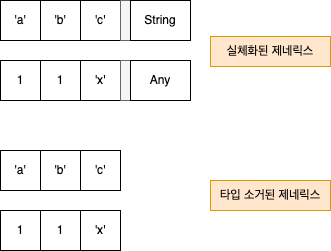

# Atomic Kotlin 79~

## atom 79. 확장 람다
- 확장 람다는 확장 함수와 비슷하다.
  - 이때 확장 함수? 기존 클래스에 새로운 함수를 추가하는 것
  - 클래스 외부에서 정의되지만, 클래스의 멤버 함수처럼 호

```kotlin
val va: (String, Int) -> String = { str, n ->
  str.repeat(n) + str.repeat(n)
}

val vb: String.(Int) -> String = {
  this.repeat(it) + repeat(it)
}

fun main() {
  va("Vanbo", 2) eq "VanboVanboVanboVanbo"
  "Vanbo".vb(2) eq "VanboVanboVanboVanbo"    // 확잘을 호출하는 형태로 호출
  vb("Vanbo", 2) eq "VanboVanboVanboVanbo"  // 전통적인 함수 형태로 호출
  // "Vanbo".va(2) // 컴파일되지 않음
}
```
- `va()`
  - 일반 람다, String 과 Int 를 param 으로 받고, String 을 반환
  - 람다 본문 내에도 str, n -> 처럼 화살표 앞에 파라미터가 두 개 존재
- `vb()`
  - String 을 괄호 밖으로 옮겨서 String.(Int) 처럼 확장 함수 구문을 사용
  - 확장 대상 객체(여기서는 String)가 수신 객체(수신자)가 되고, this 를 통해 접근 가능
    - this.repeat(), this 를 생략한 repeat(), 파라미터가 하나뿐이면 확장 함수에서도 it 으로 유일한 파라미터 가리킬 수 있음


### 여러 파라미터를 받는 확장 함수
```kotlin
val zero: Int.() -> Boolean = {
  this == 0
}

val one: Int.(Int) -> Boolean = {
  this % it == 0
}

val two: Int.(Int, Int) -> Boolean = {
  arg1, arg2 ->
    this % (arg1 + arg2) == 0
}

val three: Int.(Int, Int, Int) -> Boolean = {
  arg1, arg2, arg3 ->
    this % (arg1 + arg2 + arg3) == 0
}

fun main() {
  0.zero() eq true
  10.one(10) eq true
  20.two(10, 10) eq true
  30.three(10, 10, 10) eq true
}
```
- `one()` 에서는 파라미터에 이름을 붙이는 대신 it 을 사용 → it 을 사용했는데 가리키는 대상이 명확하지 않다면, 명시적으로 파라미터 이름을 지정하는 편이 나음

### 함수의 파라미터로 확장 람다 사용
```kotlin
class A {
  fun af() = 1
}

class B {
  fun bf() = 2
}

fun f1(lambda: (A, B) -> Int) =
  lambda(A(), B())

fun f2(lambda: A.(B) -> Int) =
  A().lambda(B())

fun lambdas() {
  f1 { aa, bb -> aa.af() + bb.bf() }
  f2 { af() + it.bf() }
}
```
- 일반적으로 이 케이스가 많음
- f1() 보다 f2() 가 간결

### 함수의 파라미터로 확장 람다 사용 
```kotlin
fun unitReturn(lambda: A.() -> Unit) =
  A().lambda()

fun nonUnitReturn(lambda: A.() -> String) =
  A().lambda()

fun lambdaUnitReturn () {
  unitReturn {
    "Unit ignores the return value" +
    "So it can be anything ..."
  }
  unitReturn { 1 } // ... 임의의 타입 ...
  unitReturn { }   // ... 아무 값도 만들어내지 않는 경우
  nonUnitReturn {
    "Must return the proper type"
  }
  // nonUnitReturn { } // 이렇게 쓸 수 없음 > 컴파일 에러
}
```
- 위 예시에서 확장 람다의 타입이 Unit 이면, 람다 본문이 만들어낸 결과는 무시 됨
- 본문의 마지막 식의 값을 무시한다는 의미로써 return 으로 Unit 이 아닌 값을 반환하면 타입 오류가 발생

### 일반 람다 대신 확장 람다 전달
```kotlin
fun String.transform1(
  n: Int, lambda: (String, Int) -> String
) = lambda(this, n)

fun String.transform2(
  n: Int, lambda: String.(Int) -> String
) = lambda(this, n)

val duplicate: String.(Int) -> String = {  // 문자열을 주어진 횟수(it)만큼 반복
  repeat(it)
}

val alternate: String.(Int) -> String = {   // 문자열을 문자 배열로 변환한 후, 주어진 간격(it)에 해당하는 인덱스의 문자만 필터링하여 새 문자열을 만듦
  toCharArray()   // toCharArray() : 문자열을 한 글자씩 분리 (.toList() 써도 됨)
    .filterIndexed { i, _ -> i % it == 0 }  // filterIndexed() : element 의 값과 index 값을 사용할 수 잇음
    .joinToString("")
}

fun main() { 
  // hello 문자열을 5번 반복하고, 3의 배수 인덱스 문자 선택
  "hello".transform1(5, duplicate)
    .transform2(3, alternate) eq "hleolhleo"
  
  "hello".transform2(5, duplicate)
    .transform1(3, alternate) eq "hleolhleo"
}
```
- 일반 람다를 파라미터로 받는 위치에 확장 람다를 전달할 수도 있음, 이때 두 람다의 파라미터 목록이 서로 호한되어야 함
- 위 예시에 대해
  - transform1() 은 일반 람다를 인자로 받지만, transform2()는 확장 람다를 인자로 받음
  - main() 에서 확장 람다 duplicate 와 alternate 를 transform1() 과 transform2() 에 전달
  - 확장 람다 duplicate 와 alternate 를 transform1()에 넘긴 경우, 두 람다의 내부에서 수신객체 this 는 모두 첫 번째 인자인 String 객체가 됨

### ::를 사용한 함수 참조
```kotlin
fun Int.d1(f: (Int) -> Int) = f(this) * 10

fun Int.d2(f: Int.() -> Int) = f() * 10

fun f1(n: Int) = n + 3
fun Int.f2() = this + 3

fun main() {
  74.d1(::f1) eq 770
  74.d2(::f1) eq 770
  74.d1(Int::f2) eq 770
  74.d2(Int::f2) eq 770
}
```
- `::` 를 사용하면 확장 함수가 필요한 곳에 함수 참조를 넘길 수 있음
- 확장 함수에 대한 참조 = 확장 람다 (타입이 같음)

<details> <summary>함수 및 결과 설명</summary>


- `d1()`
  - Int 의 확장 함수 
  - 매개변수로 Int 를 받아 Int 로 반환하는 함수 f 를 받음
  - this(Int 값)를 f 에 전달하고, 그 결과에 10을 곱함
- `d2()`
  - Int 의 확장 함수
  - 매개변수로 Int 를 받아 Int 로 반환하는 함수 f 를 받음
  - 
- `f1()`
  - 일반 함수로, Int 를 받아 3을 더한 값을 반환
- `f2()`
  - Int 의 확장 함수로, 현재 값에 3을 더한 결과를 반환

1. 74.d1(::f1) eq 770 
   - f1 함수를 d1에 전달
   - 74 + 3 = 77 → 77 * 10 = 770
2. 74.d2(::f1) eq 770
   - f1 함수를 d2에 전달
   - 여기서 f1은 확장 함수가 아니지만, Kotlin 은 자동으로 변환 해줌
   - 74 + 3 = 77 → 77 * 10 = 770
3. 74.d1(Int::f2) eq 770 
   - f2 함수를 d1에 전달 
   - Int::f2는 확장 함수를 일반 함수로 변환 
   - 74 + 3 = 77 → 77 * 10 = 770
4. 74.d2(Int::f2) eq 770
   - f2 함수를 d2에 전달 
   - 74 + 3 = 77 → 77 * 10 = 770

</details>


### 다형성
* 다형성이란 하나의 타입에 여러 객체를 대입할 수 있는 성질
```kotlin
// Open 클래스, f() 메서드 가짐
open class Base { 
  open fun f() = 1  
}

// Base 상속 받아 f() 메서드 오버라이드
class Derived : Base() {
  override fun f() = 99 
}

// g() 는 Base 의 확장 함수, f() 호출함
fun Base.g() = f()


// h() 는 Base 의 확장 함수, 함수 타입 매개변수 xl() 을 받아 실행
fun Base.h(xl: Base.() -> Int) = xl() 

fun main() { 
  // Derived  객체 생성, Base 타입 변수에 할당 >  업캐스트
  val b: Base = Derived()
  b.g() eq 99
  b.h { f() } eq 99
}
```
- 일반 확장 함수인 Base.g() 와 확장 람다인 Base.h() 모두에서 (수신 객체의 f 호출 시) 다형성이 동작함
  - 이게 무슨 의미냐? 
  - g() 는 Base 클래스의 확장 함수이나, 실제 호출되는 f() 는 런타임 시 결정 됨 → Derived 객체에 대해 g() 호출하면 Derived 에 오버라이드 된 f() 메서드가 실행
  - b.h { f() } 역시 람다 내부의 f() 도 수신 객체의 실제 타입에 따라 결정됨 → Derived 객체에 대해 호출하면 마찬가지로 Derived 내부어 f() 를 가리킴

### 확장 람다 대신 익명 함수 구문 사용
- 익명 함수에 대한 내용은 나중에 나옴
```kotlin
fun exec(
    arg1: Int, arg2: Int,
    f: Int.(Int) -> Boolean
) = arg1.f(arg2)

fun main() {
    exec(10, 2, fun Int.(d: Int): Boolean {
        return this % d == 0
    }) eq true
}
``` 
- 익명 확장 함수를 익명 람다 위치에 사용할 수 있음

### `StringBuilder` 와 `buildString()`
- 코틀린 표준 라이브러리 중, 확장 람다를 사용하는 예시
```kotlin
private fun messy(): String {
  val built = StringBuilder()      // [1] String 가변 객체
  built.append("ABCs: ")
  ('a'..'x').forEach { built.append(it) }
  return built.toString()          // [2] toString 을 통해 불변 String 으로 만들 수 잇음
}


// buildString 예시
// 확장 람다를 인자로 받아서, String 가변 객체 생성하고 toString() 호출 해주는 것까지 알아서 해줌 
// 수신 객체는 항상 StringBuilder, 인자는 람다
private fun clean() = buildString { 
  append("ABCs: ")
  ('a'..'x').forEach { append(it) }
}


// joinToString() 으로 문자열 생성
private fun cleaner() =
  ('a'..'x').joinToString("", "ABCs: ")

fun main() {
  messy() eq "ABCs: abcdefghijklmnopqrstuvwx"
  messy() eq clean()
  clean() eq cleaner()
}
```

### `buildList()`, `buildMap(): forEachIndexed()`
```kotlin
val characters: List<String> = buildList {
    add("Chars:")
    ('a'..'d').forEach { add("$it") }
}

val charmap: Map<Char, Int> = buildMap {
    ('A'..'F').forEachIndexed { n, ch ->
        put(ch, n)
    }
}

fun main() {
    characters eq "[Chars:, a, b, c, d]"
    //  characters eq characters2
    charmap eq "{A=0, B=1, C=2, D=3, E=4, F=5}"
}
```
- buildString 와 비슷하게 확장 람다를 사용하여 읽기 전용(불변) List 와 Map 을 만들어주는 함수 

### 확장 람다를 사용해 빌더 작성 (빌더 패턴)
- 이래저래 객체를 생성하는 생성자들의 선언함에 있어 경우의 수가 너무 많아서 생성자 만으로는 코드가 너무 지저분 해지거나, 적절한 생성자 조합을 만들지 못할 수도 있음
- 이때 사용하면 좋은 것이 빌더 패턴
  - 여러 단계에 거쳐 객체를 생성하여, 객체 생성이 복잡할 때 유용
  - 동일한 기본 생성 코드를 사용 > 다양한 조합의 객체 생성 가능
  - 공통 생성 코드와 특정 객체를 위한 특화된 코드를 분리할 수 있음. 객체들의 특징에 따른 코드를 쉽게 작성, 가독성도 좋음
```kotlin
// ArrayList<RecipeUnit> 을 상속받은 오픈 클래스
open class Recipe : ArrayList<RecipeUnit>()

// 예시의 기본 클래스 (레시피 구성 요소)
open class RecipeUnit {
    override fun toString() =
        "${this::class.simpleName}"
}

// 예시에서 각각 요리 방법을 나타내는 클래스임
open class Operation : RecipeUnit()
class Toast : Operation()
class Grill : Operation()
class Cut : Operation()

// 예시에서 각각 요리 재료를 나타내는 클래스임
open class Ingredient : RecipeUnit()
class Bread : Ingredient()
class PeanutButter : Ingredient()
class GrapeJelly : Ingredient()
class Ham : Ingredient()
class Swiss : Ingredient()
class Mustard : Ingredient()

// Recipe 을 상속받은 클래스 
open class Sandwich : Recipe() {
    fun action(op: Operation): Sandwich {
        add(op)
        return this
    }
    fun grill() = action(Grill())
    fun toast() = action(Toast())
    fun cut() = action(Cut())
}

// 빌더 함수, `Sandwich.() -> Unit` 타입의 확장 람다를 매개변수로 받음
// 기본적인 동작, 빵을 추가하고 굽고 자르고는 동일하고 fillings 으로 받은 함수를 중간에 추가해줌
fun sandwich(
    fillings: Sandwich.() -> Unit
): Sandwich {
    val sandwich = Sandwich()
    sandwich.add(Bread())
    sandwich.toast()
    sandwich.fillings()
    sandwich.cut()
    return sandwich
}

fun main() {
    // 람다 내부에서 클래스 내부의 메서드를 직접 호출할 수 잇음
    val pbj = sandwich {
        add(PeanutButter())
        add(GrapeJelly())
    }
    val hamAndSwiss = sandwich {
        add(Ham())
        add(Swiss())
        add(Mustard())
        grill()
    }
    pbj eq "[Bread, Toast, PeanutButter, " +
            "GrapeJelly, Cut]"
    hamAndSwiss eq "[Bread, Toast, Ham, " +
            "Swiss, Mustard, Grill, Cut]"
}
```
- 위는 여러 종류의 샌드위치를 조리하기 위한 재료와 절차를 담는 시스템 구현 예시

---
## atom 80. 영역 함수
- 영역 함수는 객체의 이름을 사용하지 않아도 그 객체에 접근할 수 있는 임시 영역을 만들어주는 함수
  - 코드의 가독성을 높이기 위해서 존재하고, 그 외에 다른 추가 기능은 없음
- 수신 객체를 명시하지 않고 람다의 본문 안에서 다른 객체의 메서드를 호출할 수 있도록 해주며, 이를 **수신 지정 람다(Lambda with receiver)** 라고 함 
- `let()`, `run()`, `with()`, `apply()`, `also()` 다섯가지 영역 함수가 존재 
- 각 영역 함수는 문맥 객체를 it 으로 다루는지, this 로 다루는지에 따라 어떤 값을 반환할지 달라짐
  - 이때 문맥 객체란, 상태 정보를 담고 있는 객체를 의미


- 다섯가지 영역 함수 중 `with()` 만 다른 호출 문법을 사용함, 아래는 간단한 예시
  - 예시 보면 알겠지만, `with()` 만 일반 함수이고 나머지는 확장 함수임
  - 그래서 `with()` 만 `with(객체) {...}` 형태이고 / 나머지는 `객체.함수() {...}` 형태
```kotlin
data class Tag(var n: Int = 0) {
    var s: String = ""
    fun increment() = ++n
}

fun main() {
    // let(): 객체를 'it' 으로 참조
    // 람다의 마지막 식의 값을 반환한다 (여기서는 여기서는 `it.increment()`의 결과)
    Tag(1).let {
        it.s = "let: ${it.n}"
        it.increment()
    } eq 2

    // let()을 사용하면서 람다 인자에 이름을 붙인 경우다 (지정 이름/tag)
    Tag(2).let { tag ->
        tag.s = "let: ${tag.n}"
        tag.increment()
    } eq 3

    // run(): 객체를 'this'로 참조
    // 람다의 마지막 식의 값을 반환한다
    Tag(3).run {
        s = "run: $n"     // 암시적 'this'
        increment()  // 암시적 'this'
    } eq 4

    // with(): 객체를 첫 번째 인자로 받고, 'this'로 참조
    // 람다의 마지막 식을 반환한다
    with(Tag(4)) {
        s = "with: $n"
        increment()
    } eq 5

    // apply(): 객체를 'this'로 참조
    // 변경된 객체를 다시 반환한다
    Tag(5).apply {
        s = "apply: $n"
        increment()
    } eq "Tag(n=6)"

    // also(): 객체를 'it'으로 참조
    // 변경된 객체를 다시 반환한다
    Tag(6).also {
        it.s = "also: ${it.n}"
        it.increment()
    } eq "Tag(n=7)"

    // also()에서도 람다의 인자에 이름을 붙일 수 있다 (지정 이름/tag)
    Tag(7).also { tag ->
        tag.s = "also: ${tag.n}"
        tag.increment()
    } eq "Tag(n=8)"
}
```
|           CASE            |     `this` 문맥 객체     | `it` 문맥 객체 |
|:-------------------------:|:--------------------:|:-------:|
|     람다의 마지막 식의 값을 반환      |    `with()`, `run()`     | `let()` |
| 수신 객체를 반환 (변경된 객체를 다시 반환) |       `apply()`        | `also()` |


- 결과를 만들어야 하는 경우 람다의 마지막 식의 값을 돌려주는 영역 함수인 `let()`, `run()`, `with()`
- 객체에 대한 호출 식을 연쇄적으로 사용해야 하는 경우 변경한 객체를 돌려주는 영역 함수인 `apply()`, `also()`

### 안전한 호출(?.) 로 영역 함수 사용
- 안전한 접근 연산자를 사용하면 수신 객체가 null 이 아닌 경우에만 영역 함수가 호출됨
```kotlin
fun gets(): String? =
  if (Random.nextBoolean()) "str!" else null

fun main() {
  gets()?.let {  // gets() 의 반환값이 null 이 아닐때만 let 이 호출
    it.removeSuffix("!") + it.length 
  }?.eq("str4")
}
```
- 문맥 객체에 대해 안전한 호출을 적용하게 되는 경우, 영역 함수 내부로 들어가기 전 null 검사를 수행함
- 안전한 호출을 하지 않는다면? 영역 함수 안에서 개별적으로 검사를 해야함 
- 아래 예시의 경우 [1]~[4] 가 안전한 호출을 적용하는 케이스
```kotlin
class Gnome(val name: String) {
fun who() = "Gnome: $name"
}

fun whatGnome(gnome: Gnome?) {
gnome?.let { it.who() }     // [1]
gnome.let { it?.who() }
gnome?.run { who() }        // [2]
gnome.run { this?.who() }
gnome?.apply { who() }      // [3]
gnome.apply { this?.who() }
gnome?.also { it.who() }    // [4]
gnome.also { it?.who() }
// No help for nullability:
with(gnome) { this?.who() }
}

```

### 영역 함수를 Map 검색 결과에 적용
- Map 에서 key 에 해당하는 원소를 찾을 수 있다는 보장이 없기 때문에 객체를 읽어오는 함수의 반환값도 null 이 될 수 있음
```kotlin
data class Plumbus(var id: Int)

fun display(map: Map<String, Plumbus>) {
  trace("displaying $map")
    
  // map["main"] 이 null 이 아니면 let 블럭 실행
  // it.id를 10 증가시키고, 수정된 객체 반환  
  val pb1: Plumbus = map["main"]?.let {
    it.id += 10
    it
  } ?: return
  trace(pb1)
    
  // map["main"] 이 null 이 아니면 run 블럭 실행
  // id 9 증가 시키고 수정된 객체(this) 반환
  val pb2: Plumbus? = map["main"]?.run {
    id += 9
    this
  }
  trace(pb2)

  // map["main"] 이 null 이 아니면 apply 블럭 실행
  // id 8 증가 시키고 수정된 객체 자체 반환
  val pb3: Plumbus? = map["main"]?.apply {
    id += 8
  }
  trace(pb3)

  // map["main"] 이 null 이 아니면 also 블럭 실행      
  // it.id 7 증가 시키고, 수정된 객체 자체 반환
  val pb4: Plumbus? = map["main"]?.also {
    it.id += 7
  }
  trace(pb4)
}

fun main() {
  display(mapOf("main" to Plumbus(1)))
  display(mapOf("none" to Plumbus(2)))
  trace eq """
    displaying {main=Plumbus(id=1)}
    Plumbus(id=11)
    Plumbus(id=20)
    Plumbus(id=28)
    Plumbus(id=35)
    displaying {none=Plumbus(id=2)}
  """
}
```
### 연쇄 호출에서 null 이 될 수 있는 타입과 영역 함수
- 영역 함수는 연쇄 호출에서 null 이 될 수 있는 타입과 함께 사용할 수 있음
- 
```kotlin
// 4개의 익명 함수를 포함하는 리스트
val functions = listOf(
  // 아래 4 개의 익명 함수는 아래를 기본으로 하고, 이후 각 영역 함수를 사용하여 결과를 처리함  
  // name 이 null 이 아닌 경우 다음 단계 진행, `takeUnless`를 사용해 빈 문자열이 아닌 경우에만 다음 단계 진행

  fun(name: String?) {
    name
      ?.takeUnless { it.isBlank() }
      ?.let { trace("$it in let") }
  },
  fun(name: String?) {
    name
      ?.takeUnless { it.isBlank() }
      ?.run { trace("$this in run") }
  },
  fun(name: String?) {
    name
      ?.takeUnless { it.isBlank() }
      ?.apply { trace("$this in apply") }
  },
  fun(name: String?) {
    name
      ?.takeUnless { it.isBlank() }
      ?.also { trace("$it in also") }
  },
)

fun main() {
  functions.forEach { it(null) }
  functions.forEach { it("  ") }
  functions.forEach { it("Yumyulack") }
  trace eq """
    Yumyulack in let
    Yumyulack in run
    Yumyulack in apply
    Yumyulack in also
  """
}
```
- `takeUnless()`
  - Kotlin 표준 라이브러리에 포함된 확장 함수
  - 객체에 대해 호출되며, 조건을 나타내는 predicate 함수를 인자로 받음
  - predicate 가 true 이면 null 을 반환하고, false 이면 자기 자신인 this 를 반환함

### 영역 함수와 자원 해제
- 영역 함수는 자원 해제 `use()` 처럼 자원 해제를 별도로 제공하지 않음
  - `use()` : 인자로 받은 코드 블록을 실행하고 그 블록을 어떻게 빠져나왔던지 관계없이 객체의 `close()` 를 호출 해줌
  - `use()` 의 경우 람다에서 반환을 허용하지 않음 (Kotlin 의 비지역 반환(non-local return) 규칙이 있다고 함)
  - <details> <summary>비지역 반환 관련</summary>
    
    - 기본적으로 람다는 로컬 반환만 허용하고, 람다 내부에서 `return` 키워드를 사용하면 람다 자체만 종료됨
    - 비지역 반환은 람다를 포함하는 외부 함수까지 종료시키는 것을 의미
    - Kotlin 에서는 일반적인 `return` 키워드를 사용하여 람다 내부에서 이러한 비지역 반환을 허용하지 않음
    - `use` 함수는 일반적으로 인라인(inline)되지 않으며, 인라인 되지 않는 함수는 비지역 반환이 불가능함
    - `use` 함수는 람다 실행 후 `close()` 메서드를 반드시 호출해야하는데, 비지역 반환을 허용하면 `close()` 호출을 보장할 수 없어짐
    
    </details>

```kotlin
data class Blob(val id: Int) : AutoCloseable {
  override fun toString() = "Blob($id)"
  fun show() { trace("$this")}
  override fun close() = trace("Close $this")
}

fun main() {
  Blob(1).let { it.show() }
  Blob(2).run { show() }
  with(Blob(3)) { show() }
  Blob(4).apply { show() }
  Blob(5).also { it.show() }
  Blob(6).use { it.show() }
  Blob(7).use { it.run { show() } }  // 영역 함수를 사용하면서 자원 해제를 보장하고 싶다면 영역 함수를 use() 람다 안에 사용해야 함
  Blob(8).apply { show() }.also { it.close() }
  Blob(9).also { it.show() }.apply { close() }
  Blob(10).apply { show() }.use {  }
  trace eq """
    Blob(1)
    Blob(2)
    Blob(3)
    Blob(4)
    Blob(5)
    Blob(6)
    Close Blob(6)
    Blob(7)
    Close Blob(7)
    Blob(8)
    Close Blob(8)
    Blob(9)
    Close Blob(9)
    Blob(10)
    Close Blob(10)
  """
}
```

---
## atom 81. 제네릭스 만들기
- 제네릭스란, 나중에 지정할 타입에 대해 작동하는 코드를 의미
- 일반 클래스와 함수는 구체적인 타입에 대해 작동하는데, 여러 타입에 걸쳐 작동하는 코드를 작성하고 싶을 때는 이런 것들이 제약이 될 수 있음 
  - 다형성은 객체 지향의 일반화 도구이고, `미리 정하지 않은 타입` 인 제네릭 타입 파라미터를 사용하면 더 일반적인 코드를 짤 수 있음. 


### Any
- 자바에서 Object 가 클래스 계층의 최상위 타입이듯, 코틀린에서는 `Any` 타입이 모든 null 이 될 수 없는 타입의 최상위 계층임
  - 코틀린 클래스 계층의 루트, 모든 코틀린 클래스는 Any 를 상위 클래스로 가짐
  - 변수 선언, 함수 매개변수, 컬랙션에서 사용 등등
  - Any 는 null 이 될 수 없는 타입이므로 만일 null 을 포함하는 모든 값을 대입할 변수를 선언하려면 Any? 타입을 사용

- Any 를 사용하는 방법 두 가지
  - Any 에 대해서만 연산을 수행하고, 다른 어느 타입도 요구하지 않는 것 (이런 경우는 극히 제한적임)
    - Any 에는 멤버 함수가 equals(), hashCode(), toString() 세 가지 뿐
    - 확장 함수도 있지만 이런 확장 함수는 Any 타입 객체에 대해 직접 연산을 적용할 수는 없음
      - 예를 들어, Any.apply() 는 함수 인자를 Any 에 적용할 뿐, Any 타입 객체의 내부 연산을 직접 호출할 수 없음
  - Any 타입 객체의 실제 타입을 알 경우 타입을 변환하여 구체적인 타입에 다른 연산 수행
    - 이 과정에서 실행 시점에 타입 정보가 필요(= 다운캐스트)하므로 타입 변환 시 잘못된 타입을 지정하면 런타임 오류 발생 (성능도 저하됨)
- 아래는 Any 를 잘못 사용 하는 예시
  -  의사 소통 기능을 제공하는 3가지 타입이 있으며, 이들은 서로 다른 라이브러리에 속해있어서 같은 클래스 계층 구조안에 그냥 넣을 수 없고, 의사 소통에 사용되는 함수명도 모두 다른 경우에 대한 예시
  - 만약 talk() 가 앞으로 다른 타입의 값을 처리할 일이 없으면 괜찮은데, 새로운 타입이 추가되면 그때마다 talk() 함수 변경해야함...
```kotlin
class Person {
  fun speak() = "Hi!"
}

class Dog {
  fun bark() = "Ruff!"
}

class Robot {
  fun communicate() = "Beep!"
}

fun talk(speaker: Any) = when (speaker) {
  is Person -> speaker.speak()
  is Dog -> speaker.bark()
  is Robot -> speaker.communicate()
  else -> "Not a talker" // 또는 예외 발생
}

fun main() {
  talk(Person()) eq "Hi!"
  talk(Dog()) eq "Ruff!"
  talk(Robot()) eq "Beep!"
  talk(11) eq "Not a talker"
}
```

### 제네릭스 정의하기
- 중복된 코드는 제네릭 함수나 타입으로 변환하는 것을 고려해볼만하다고 함
- 제네릭스가 나중에 지정할 타입에 대해 작동하는 코드를 의미하는 것을 미루어 생각해봤을 때, 제네릭 함수는 어떠한 타입으로도 정의 가능한 함수라고 할 수 있음
- 홑화살괄호 (<>) 안에 제네릭 플레이스 홀더를 하나 이상 넣으면 제네릭 함수나 타입을 정의할 수 있음
  - 제네릭 플레이스 홀더?  제네릭 버전의 함수는 (Int, String, Double 같은) 실제 타입 이름 대신 플레이스홀더(placeholder, 이 케이스에선 T) 타입 이름을 사용
  - 이때 T 를 대신해 사용할 실제 타입은 함수가 호출되는 시점에 결정됨
```kotlin
// 타입 파라메터로 T 를 받고, T 를 반환하는 제네릭 함수 정의
// 이때 제네릭 파라미터 T 는 정해지지 않은 타입을 표현함 
fun <T> gFunction(arg: T): T = arg

// T 타입의 속성 x 를 가지는 제네릭 클래스 (T를 저장)
class GClass<T>(val x: T) {
  // 멤버함수 f(), T 반환
  fun f(): T = x
}

// 제네릭 멤버 함수
class GMemberFunction {
  fun <T> f(arg: T): T = arg
}

// 제네릭 인터페이스
interface GInterface<T> {
  // T 타입의 속성 x와 T를 반환하는 f() 메서드를 가진 제네릭 인터페이스
  // 멤버 함수를 파라미터화 함   
  val x: T
  fun f(): T
}

// 제네릭 인터페이스 구현 (GInterface를 구현)
class GImplementation<T>(
  override val x: T
) : GInterface<T> {
  override fun f(): T = x
}

// 구체적인 타입으로 제네릭 인터페이스 구현 (GInterface을 구현하는 구체적인 클래스)
class ConcreteImplementation
  : GInterface<String> {
  override val x: String
    get() = "x"
  override fun f() = "f()"
}

fun basicGenerics() {
  gFunction("Yellow")   // T는 String으로 추론됨
  gFunction(1)  // T는 Int 로 추론됨
  gFunction(Dog()).bark()            // [1] T는 Dog 로 추론되며, Dof 객체에서 bark() 호출
  gFunction<Dog>(Dog()).bark()  // T를 명시적으로 Dog로 지정

  GClass("Cyan").f()
  GClass(11).f()
  GClass(Dog()).f().bark()           // [2]
  GClass<Dog>(Dog()).f().bark()

  GMemberFunction().f("Amber")
  GMemberFunction().f(111)
  GMemberFunction().f(Dog()).bark()  // [3]
  GMemberFunction().f<Dog>(Dog()).bark()

  GImplementation("Cyan").f()
  GImplementation(11).f()
  GImplementation(Dog()).f().bark()  // T는 Dog로 추론됨, f()가 반환한 Dog 객체에서 bark() 호출

  ConcreteImplementation().f()  // 항상 String 반환
  ConcreteImplementation().x  // 항상 String 반환
}
```
- 위의 예시에서 [1]~[3] 결과에 해새 bark() 를 호출할 수 있음, 결과 타입이 Dog 라는 타입으로 정의 되어잇기 때문
  - 타입 추론에 의해 타입 파라미터의 구체적인타입이 결정됨
  - 제네릭이나, 제네릭을 호출하는 코드가 너무 복잡하면 컴파일러가 제대로 타입을 추론하지 못하는 케이스가 있을 수 있으므로, 직접 구체적인 타입을 명시해주는 것이 좋음


### 타입 정보 보존
- 제네릭 클래스나 제네릭 함수의 내부 코드는 T 타입에 대해 알 수 없고, 이를 `타입 소거` 라고 함 (뒤에서 좀 더 자세하게 설명할 예정)
- 타입 소거 때문에 런타임에 타입 정보가 완전히 유지되지 않을 수 있음

```kotlin
// toString() 메서드를 오버라이드 하여 "Car" 문자열을 반환하는 클래스
class Car { 
  override fun toString() = "Car"
}

// Car 객체를 저장하고 반환하는 클래스 / 생성자에 Car 객체를 받아 private 변수 c에 저장
class CarCrate(private var c: Car) {  
  fun put(car: Car) { c = car }  // 새로운 Car 객체 생성 가능
  fun get(): Car = c  // 저장된 Car 객체 반환
}

fun main() {
  val cc = CarCrate(Car())  // CarCreate 객체를 생성하고, Car 객체 저장
  val car: Car = cc.get()  // get()을 호출하여 Car 객체 가지고 옴
  car eq "Car"
}
```
- 위 예시에서 cc.get() 을 호출하면 Car 타입의 결괏값이 나옴. 근데 이걸 Car 뿐만 아니라 다른 타입에 대해서도 활용하고 싶다면?

```kotlin
// Open 타입의 Crate 클래스는 제네릭 타입 T를 사용 (생성자에서 T 타입의 contents를 받음)
open class Crate<T>(private var contents: T) { 
  fun put(item: T) { contents = item }  // T 타입의 item 을 받아 contentes 업데이트
  fun get(): T = contents  // T 타입의 contents 반환
}

fun main() {
  val cc = Crate(Car())  // Crate 타입의 cc 객체를 생성
  val car: Car = cc.get()  // get() 호출하여 Car 객체 가지고 옴
  car eq "Car"
  
  // 다른 타입을 넣어본다면?
  // Int 타입 사용
  val intCrate = Crate(42)
  val number: Int = intCrate.get()
  number eq 42
  
}
```
- Create<T> 로 일반화를 했음 (제네릭을 사용하여 Crate 클래스를 일반화)
  - T 타입의 값만 Crate 에 put() 으로 넣을 수 있도록 보장, get() 을 호출하면 T 타입의 값이 결과로 나오도록 보장

### 타입 파라미터 제약
- 타입 파라미터 제약은 클래스나 함수에 사용할 수 있는 타입 인자를 제한하는 것
- 타입 파라미터 제약은 제네릭 타입 인자가 다른 클래스를 상속해야 한다고 지정함
  - 예를 들어 <T: Base> 는 T 가 Base 타입이거나, Base 에서 파생된 타입이어야함을 의미
```kotlin
// name 속성과 action() 메서드를 정의한 인터페이스
interface Disposable { 
  val name: String
  fun action(): String
}


// Disposable 를 구현한 Compost 클래스
class Compost(override val name: String) :
  Disposable {
    override fun action() = "Add to composter"
  }

// Disposable 를 상속받은 인터페이스 (운반이 필요한 항목에 대한 정의)
interface Transport : Disposable

// Transport 를 구현한 클래스들 (각각 기부, 재활용, 매립 가능 항목을 나타냄)
class Donation(override val name: String) :
  Transport {
    override fun action() = "Call for pickup"
  }

class Recyclable(override val name: String) :
  Transport {
    override fun action() = "Put in bin"
  }

class Landfill(override val name: String) :
  Transport {
    override fun action() = "Put in dumpster"
  }

// 객체 리스트, 다양한 타입의 Disposable 객체가 저장됨
val items = listOf(
  Compost("Orange Peel"),
  Compost("Apple Core"),
  Donation("Couch"),
  Donation("Clothing"),
  Recyclable("Plastic"),
  Recyclable("Metal"),
  Recyclable("Cardboard"),
  Landfill("Trash"),
)

// filterIsInstance<Recyclable>() 메서드를 사용하여, Recyclable 타입의 객체만 필터링
// filterIsInstance 는 특정 타입의 객체만 필터링해줌
val recyclables =
  items.filterIsInstance<Recyclable>()
```
- 위를 기준으로, 타입 파라미터 제약으로 Base 를 지정하는 경우와, Base 를 상속하지만 제네릭하지 않은 일반 타입의 차이를 설명할 예정

### 제네릭 타입 파라미터 제약
- 특정 타입의 상위 클래스나 인터페이스로 타입을 제한하는 방법
- 제약을 가하려면 타입 파라메터 이름 뒤에 콜론 : 을 붙이고 그 뒤에 상한 타입을 명시하면 됨
  - 상한 타입을 정하고 나면 T 타입의 값을 상한 타입의 값으로 취습할 수 있게 됨
  - 제네릭 타입을 인스턴스화 할 때는 타입 인자를 반드시 상한 타입 혹은 상한 타입의 하위 타입으로 !

- Disposable 인터페이스를 구현한 객체의 이름을 가지고 오는 함수를 구현하는 두 가지 방식 예시
```kotlin
// 제네릭 함수 nameOf 를 사용
// 제네릭 타입 T를 사용하며, T는 Disposable 인터페이스를 구현해야함 (구체적인 타입 명시하는 것 - 제약)
// T 는 타입 파라미터이고, Disposable 은 상한 타입
fun <T: Disposable> nameOf(disposable: T) =
  disposable.name  // name 속성 반환

// 확장 함수
// Disposable 을 구현한 모든 타입에 대해 사용이 가능함 
// T는 해당 타입의 인스턴스에서 직접 호출할 수 있는 메서드가 됨
fun <T: Disposable> T.name() = name

fun main() {
  recyclables.map { nameOf(it) } eq
    "[Plastic, Metal, Cardboard]"
  recyclables.map { it.name() } eq
    "[Plastic, Metal, Cardboard]"
}
```
- 제네릭스를 사용하면 타입 파라메터를 받는 타입을 정의할 수 있음
- 제네릭 타입의 인스턴스를 만들려면 타입 파라메터를 구체적인 타입 인자로 치환해야함
  - 제네릭 클래스에 구체적인 타입을 인자로 넘기면 타입을 인스턴스화 할 수 있음 
- 위의 예시에서 제약을 사용하지 않으면 name 을 사용할 수 없다.
  - 제약 없이 제네릭 타입 T를 사용하면, 컴파일러는 T가 `name` 속성을 가지고 있는지 확신할 수 었음. 
  - 컴파일러는 기본적으로 T 를 `Any 타입`으로 간주하며, `Any 타입`에는 기본적으로 `name` 속성이 없음
  - 즉, `T: Disposable` 을 통해 T가 `name` 속성을 반드시 가지고 있음을 보장 → `name` 을 안전하게 사용할 수 있게 해줌9 

```kotlin
// Disposable 타입 매개변수를 받아 그 객체의 name 반환
fun nameOf2(disposable: Disposable) =
  disposable.name

// Disposable 인터페이스에 대한 확장 함수
fun Disposable.name2() = name

fun main() {
  recyclables.map { nameOf2(it) } eq
    "[Plastic, Metal, Cardboard]"
  recyclables.map { it.name2() } eq
    "[Plastic, Metal, Cardboard]"
}
```
- 제네릭스를 쓰지 않고, 같은 결과를 내는 예시


### 다형성 대신 타입 파라미터 제약
- 다형성 대신 타입 파라미터 제약을 사용하는 것은, 반환 타입 때문!
- 다형성을 사용하는 경우엔 반환 타입을 기반 타입으로 업캐스트하여 반환해야 하지만, 제네릭스를 사용하면 정확한 타입을 지정할 수 있음
```kotlin
private val rnd = Random(47)

// Disposable 타입, 리스트에 대한 확장 함수
// 반환 타입이 고정되어있으며, 다형성을 사용하지만 반환 타입이 상위 타입으로 제한됨
// 즉, 실제로 반환 타입은 Disposable 로 업캐스트 됨
fun List<Disposable>.aRandom(): Disposable =
  this[rnd.nextInt(size)]

// Disposable 을 상속받는 제네릭 타입 T의 리스트에 대한 확장 함수
// 반환 타입이 T, 실제 요소의 타입을 유지
// 제네릭 타입 제약을 사용하여, Disposable 의 하위 타입에 대해 동작할 수 있음 
fun <T: Disposable> List<T>.bRandom(): T =
  this[rnd.nextInt(size)]


// 완전히 제네릭
// 어떤 타입도 다 사용할 수 있음
fun <T> List<T>.cRandom(): T =
  this[rnd.nextInt(size)]

fun sameReturnType() {
  // 위의 예제에서 recyclables 은 Recyclable 타입의 객체만 필터링한 리스트
  val a: Disposable = recyclables.aRandom()  // Disposable 타입, Recyclable 타입에서 상위 타입으로 업캐스트 됨
  val b: Recyclable = recyclables.bRandom()  // Recyclable 타입 유지
  val c: Recyclable = recyclables.cRandom()  // Recyclable 타입 유지, 근데 이건 컴파일러가 recyclables 타입을 알고 있어서임
}
```

### 타입 파라미터를 사용해야 하는 경우
- 타입 파라미터 안에 선언된 함수나 프로퍼티에 접근해야 할 때
- 결과를 반환할 때 타입을 유지해야하는 경우
```kotlin
private val rnd = Random(47)

// List<Disposable> 의 확장 함수, Disposable 타입을 반환
// action()에 접근할 수 있지만, 반환 타입이 상위 타입인 Disposable 로 제한됨 (정확한 타입 반환 불가)
fun List<Disposable>.inexact(): Disposable {
  val d: Disposable = this[rnd.nextInt(size)]
  d.action()
  return d
}


// 완전히 제네릭한 List<T> 의 확장 함수
// 타입 제약이 없어서 action()에 접근할 수 없다
fun <T> List<T>.noAccess(): T {
  val d: T = this[rnd.nextInt(size)]
  // d.action()
  return d
}

// T가  Disposable 의 하위 타입, List<T> 의 확장 함수
// action() 에 접근 가능하고 정확한 타입을 반환한다
fun <T: Disposable> List<T>.both(): T {
  val d: T = this[rnd.nextInt(size)]
  d.action()
  return d
}

fun constraints() {
  val i: Disposable = recyclables.inexact()  // Disposable 타입 반환
  val n: Recyclable = recyclables.noAccess()  // Recyclable 타입 반환
  val b: Recyclable = recyclables.both()  // Recyclable 타입 반환
}
```

### 타입 소거
- 위에서 잠시 이야기 나왔던게 여기서 자세히 설명
- 타입 소거? 컴파일 시점에 존재하던 제네릭 타입 정보가 런타임에 제거되는 것 (제네릭 타입의 파라미터 타입이 지워져버림)
  - 최초의 자바에는 제네릭이 없다가 몇 년 후 제네릭스가 추가됨 
  - 제네릭스를 도입하면서, 기존 코드를 깨지 않는 것이 가장 중요
  - 컴파일러가 제네릭 타입을 일반 클래스로 변환, 타입 파라미터는 상한 타입 (주로 Object) 로 대체 됨
  - 그래서 제네릭 타입은 일단 컴파일 시점에만 사용할 수 있고, 런타임 바이트 코드에서는 제네릭 타입 정보가 보존되지 않음

```kotlin
fun main() {
  val strings = listOf("a", "b", "c")
  val all: List<Any> = listOf(1, 2, "x")
  useList(strings)
  useList(all)
}

fun useList(list: List<Any>) {
  // if (list is List<String>) {}  // [1]
}
```
- 위의 예시에서 주석을 해제하면 `Cannot check for instance for erased type:List<String>` 이라는 오류가 발생 (`소거된 타입 List<String> 의 인스턴스를 검사할 수 없다.`)
- 만약 타입 소거가 이뤄지지 않는다면?
  - 실제로는 아래와 같이 동작하지 않지만, 타입 소거가 되지 않는다면 어딘가에 타입 정보가 추가로 저장될 수도 있음
  - 하지만 타입 소거가 된자면, 아무 타입도 없는 List 가 되겠지..?
  

### 함수 타입 인자에 대한 실체화
- 함수 인자의 타입 정보를 보존하려면 `reified` 키워드를 사용하면 됨
  - `reified` 가 붙은 타입 인자의 타입 정보를 유지 시키라고 컴파일러에게 명령하는 것
  - 런타임에 제네릭 타입 정보에 접근할 수 있도록 해줌
  - 반드시 `inline` 함수와 함께 사용해야하며, 일반 함수나 클래스에서는 사용할 수 없음
  - `inline` 함수 ?
    - 어떤 함수에 inline 키워드를 붙이면 컴파일러는 그 함수를 호출한 지점을 찾아, 함수 호출을 모두 함수 본문으로 바꿔줌
    - 이 때 함수의 파라미터들은 호출 시 제공된 실제 인자들로 교체
  - 왜 반드시 `inline` 함수와 함께?
    - 일반적으로 제네릭 타입 정보는 컴파일 시 소거되지만, `inline` 과 `reified` 함께 사용하면 이를 우회할 수 잇음
    - `reified` 키워드를 사용하면, 컴파일 시 지워져야 할 타입 정보를 유지 시키고, 런타임에 접근할 수 있게 됨.
    - 여기서 컴파일러는 `inline` 함수 호출을 해당 함수의 본문으로 직접 대체
    - 이 과정에서 `reified` 타입 파라미터의 실제 타입 정보를 삽입하게 됨

```kotlin
// KClass<T> 타입의 매개변수를 받는 제네릭 함수 a
// T 는 Any 의 하위 타입이어야 하며, 런타임에 KClass<T> 를 사용할 수 있음  (명시적으로 타입을 전달)
fun <T: Any> a(kClass: KClass<T>) {
  // KClass<T>를 사용한다
}

// 타입 소거로 인해 컴파일되지 않음
// 제네릭 타입 정보가 컴파일 시점에서 사라져버림, T::class 를 사용할 수 없다고 에러
// 이때, ::class 는 클래스 참조 연산자이고 해당 클래스의 KClass 객체를 반환
// KClass? Kotlin 에서 클래스를 나타내는 타입
// fun <T: Any> b() = a(T::class)

// KClass<T> 타입의 매개변수를 받아 a 함수에 전달
fun <T: Any> c(kClass: KClass<T>) = a(kClass)

class K
// K에 대한 KClass 객체를 생성
// K::class 를 c 함수에 전달하여 호출
val kc = c(K::class)


// reified 사용함으로써 T를 실체화된 타입 파라미터로 만듦
// T::class 를 통해  T의 KClass 객체를 얻고, KClass 객체를 a 함수에 전달
// 컴파일러가 T::class 를 인라인 확장하여 사용
// 타입 소거를 우회
inline fun <reified T: Any> d() = a(T::class)

// K 타입을 명시적으로 지정하여, d 함수 호출
// 컴파일 시, d<K>() 호출은 결과적으로 a(K::class) 가 됨 (컴파일러가 T::class 를 K::class 로 대체)
val kd = d<K>()

```

### reified + is
- `reified` 를 사용하여 `is` 를 제네릭 파라메터에 적용한 예시
```kotlin
// 여기서 is 는 스마트 캐스트 문법
// 어떤 객체가 특정 타입인지 검사하는 것
inline fun <reified T> check(t: Any) = t is T
// fun <T> check1(t: Any) = t is T     // [1]

fun main() {
  check<String>("1") eq true
  check<Int>("1") eq false
}
```

### 타입 변성
- 변성이란, `List<String>` 과 `List<Any>` 와 같이 기반 타입이 같고, 타입 인자가 다른 여러 타입이 서로 어떤 관계가 있는지 설명하는 개념 
- 만일 T 와 U 사이에 상속 관계가 있을 때 `Container<T>` 라는 제네릭 타입 객체를 `Container<U>` 라는 제네릭 타입 컨테이너 객체에 대입하려 한다고 가정
  - 이런 경우 Container 타입을 어떤 식으로 쓸 지에 따라 Container 의 타입 파라메터에 `in` 혹은 `out` 이라는 키워드를 사용해 **변성 애너테이션(variance annotation)** 을 붙여서 타입 파라메터를 적용한 Container 타입의 상하위 타입 관계를 제한해야 함

- 아래는 기본 제네릭 타입, in T, out T 를 사용한 예시
```kotlin
class Box<T>(private var contents: T) {
  fun put(item: T) { contents = item }  // T 타입의 아이템을 받아 contents 에 저장
  fun get(): T = contents  // 저장된 contents 를 T 타입으로 반환
}

// in 키워드 사용
// T 타입 값을 인자로만 받고, T 타입 값을 반환하지 않는다는 의미
class InBox<in T>(private var contents: T) {
  fun put(item: T) { contents = item }  // T 타입의 아이템을 받아 contents 에 저장
}

// out 키워드 사용
// T 타입 값을 반환하기만 하고, T 타입 값을 인자로 받지는 않는다는 의미
class OutBox<out T>(private var contents: T) {
  fun get(): T = contents  // 저장된 contents 를 T 타입으로 반환
}
```
- in T 는 이 클래스의 멤버 함수가 T 타입의 값을 인자로만 받고, T 타입 값을 반환하지 않는다는 의미
- out T 는 이 클래스의 멤버 함수가 T 타입의 값을 반환하기만 하고, T 타입의 값을 인자로는 받지 않는다는 의미

#### 타입 변성을 사용하는 이유?
```kotlin
open class Pet
class Cat : Pet()
class Dog : Pet()
```
- Cat 과 Dog 은 Pet 의 하위 타입, `Box<Cat>` 과 `Box<Pet>` 사이에는 어떤 하위 타입 관계가 있을 수 있나?
  - `Box<Pet>` 타입의 변수에 `Box<Cat>` 객체를 대입할 수 있어야 할 것 같은 느낌
  - 하지만 실제 코드는 그렇지 않다.....

```kotlin
// Box 라는 제네릭 클래스의 인스턴스를 생성
// Box<Cat> 은 Cat 타입의 객체만 포함할 수 있는 Box 를 의미
val catBox = Box<Cat>(Cat())
// val petBox: Box<Pet> = catBox
// val anyBox: Box<Any> = catBox
```
- `Box<Cat>`은 `Box<Pet>`의 하위 타입이 아님, 이는 코틀린에서 제네릭이 기본적으로 불변이기 때문이라고 함
- 타입 안전성을 위해 `Box<Cat>`을 `Box<Any>`로 취급할 수 없음

```kotlin
// 위에서 정의된 OutBox 클래스 가지고 옴 
// out 키워드 사용
// T 타입 값을 반환하기만 하고, T 타입 값을 인자로 받지는 않는다는 의미
class OutBox<out T>(private var contents: T) {
  fun get(): T = contents  // 저장된 contents 를 T 타입으로 반환
}

val outCatBox: OutBox<Cat> = OutBox(Cat())
val outPetBox: OutBox<Pet> = outCatBox
val outAnyBox: OutBox<Any> = outCatBox

fun getting() {
  // OutBox 객체에서 객체를 가지고 오고 있음
  val cat: Cat = outCatBox.get()
  val pet: Pet = outPetBox.get()
  val any: Any = outAnyBox.get()
}
```
- OutBox 는 out 키워드 사용, **공변성** 을 가진 제네릭 클래스
  - `OutBox<Cat>`이 `OutBox<Pet>` 및 `OutBox<Any>`의 하위 타입으로 취급될 수 있음을 의미
  - 공변성(Covariance)? 
    - 공변성은 제네릭 타입이 상속 관계를 따르도록 허용합니다. 즉, `T`가 `U`의 하위 타입일 때, `OutBox<T>`는 `OutBox<U>`의 하위 타입이 됨
    - 코틀린에서 `out` 키워드


#### 무공변(invariant), 공변(covariant), 반공변(contravariant)
```
┌─────────┐     ┌───────────┐     ┌────────────────┐     ┌───────────────┐
│   Pet   │     │ Box<Pet>  │     │  OutBox<Pet>   │     │  InBox<Pet>   │
│         │     │           │     │                │     │               │
└────▲────┘     └─────X─────┘     └────────▲───────┘     └───────────────┘
     │                │                    │                     │
     │                │                    │                     │
┌─────────┐     ┌─────X─────┐     ┌────────────────┐     ┌───────▼───────┐
│   Cat   │     │ Box<Cat>  │     │  OutBox<Cat>   │     │  InBox<Cat>   │
│         │     │           │     │                │     │               │
└─────────┘     └───────────┘     └────────────────┘     └───────────────┘

```
- Box<T>
  - 무공변(invariant) 임 
    - 코틀린에서 제네릭 클래스는 기본적으로 무공변
    - 상속 관계에 상관없이 자신의 타입만 허용
  - `Box<Pet>` 과 `Box<Cat>` 은 아무런 하위 타입 관계가 없으므로 둘 중 어느 쪽도 반대쪽에 대입 불가
- OutBox<out T>
  - 공변(covariant) 임
    - `out` 키워드를 사용하여 표시
    - 자기 자신과 자식 객체를 허용
    - 타입 파라미터가 생산자(Producer) 위치에서만 사용
    - 읽기(get)는 가능하지만 쓰기(set)는 불가능, 값을 생산(반환)하는 역할만 수행
  - `OutBox<Cat>` 을 `OutBox<Pet>` 으로 업캐스트하는 방향이 `Cat` 을 `Pet` 으로 업캐스트하는 방향과 같은 방향으로 변함
    - `OutBox<Cat>`은 `OutBox<Pet>`의 하위 타입
- InBox<in T>
  - 반공변(contravariant) 임
    - `in` 키워드를 사용하여 표시
    - 자기 자신과 부모 객체만 허용
    - 타입 파라미터가 소비자(Consumer) 위치에서만 사용
    - 쓰기(set)는 가능하지만 읽기(get)는 불가능
    - 값을 소비(매개변수)하는 역할만 수행22
  - `InBox<Pet>` 을 `InBox<Cat>` 으로 업캐스트하는 방향이 `Cat` 을 `Pet` 으로 업캐스트 하는 방향과 반대 방향으로 변함
    - `InBox<Pet>`은 `InBox<Cat>`의 하위 타입